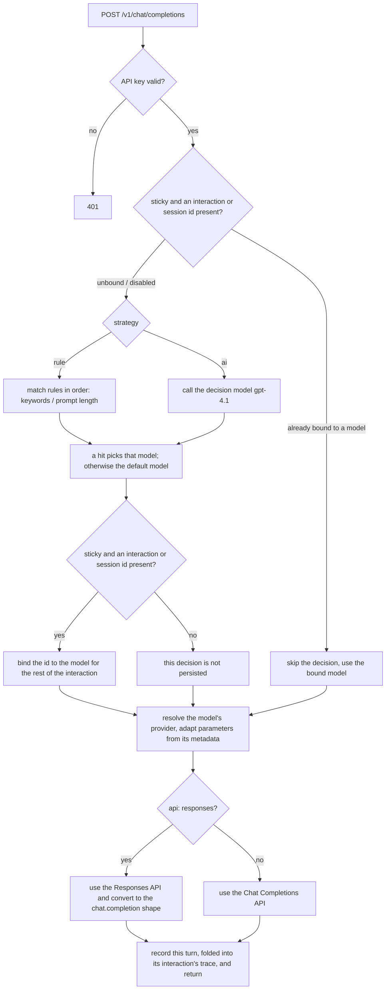

# Foundry Model Router

An OpenAI-compatible model router: it accepts `/v1/chat/completions` requests and routes them
to a suitable backend model, either by rules or by an AI decision (gpt-4.1). The backend is not
limited to Azure AI Foundry — any OpenAI-compatible address and key can be configured, and each
model can be bound to a different connection. It ships with an Azure-portal-styled React console:
GitHub sign-in, API key management, usage statistics, full-chain traces, and configuration
management.

## Getting started

```powershell
.venv\Scripts\Activate.ps1
pip install -r requirements.txt
copy config.example.yaml config.yaml     # first run: generate the local config from the template
uvicorn app.main:app --host 0.0.0.0 --port 8000
```

Open http://localhost:8000/ . The first visit lands on the **setup wizard** (see the next
section); once configured, sign in with GitHub to reach the console.

The console owns the site root and every page has its own address — `/usage`, `/keys`,
`/traces/<id>`, `/config/models`, `/access/policy` — so a page can be bookmarked or pasted to a
colleague. Any unknown path is answered with the console shell, which then renders its own
not-found view. **The former `/ui/` prefix is gone and now returns 404**; existing bookmarks need
updating, as does the `Homepage URL` of an already-registered OAuth App (cosmetic — only the
*callback* URL is validated, and it has not moved).

Behind a reverse proxy, add `--proxy-headers` so the callback URL and the cookie's `Secure` flag
follow `X-Forwarded-Proto` / `X-Forwarded-Host` correctly.

Frontend development mode (optional, with hot reload):

```powershell
cd frontend; npm run dev   # http://localhost:5173/, API calls proxied to :8000
npm run build              # the build output is served by FastAPI from /
```

## Language

The console renders in **English, Simplified Chinese, Traditional Chinese, Japanese or Korean**.
Pick a language from the selector in the top bar (also available on the sign-in and setup pages, so
the choice can be made before signing in). The choice is stored under the `locale` key in
`localStorage` and also written to `<html lang>`.

English is the source language: [frontend/src/i18n/locales/en.json](frontend/src/i18n/locales/en.json)
is authored first and acts as the fallback, and the other four catalogs are translations of it.
`node frontend/scripts/check-locales.mjs` gates key parity — all five catalogs must have identical
key sets.

**The backend deliberately speaks English only**, in every locale. Text composed server-side is not
translated: the API-key eligibility `reason`, configuration validation errors, GitHub and upstream
error messages, and the trace `analysis` notes. Those strings reach the UI verbatim, so an error
banner shows English even when the console is set to Japanese. This keeps the API's responses
identical for every client and avoids locale plumbing through the request path.

## Sign-in and authentication

**Why this exists**: when Copilot calls through BYOK it does not pass any user identity —
`x-user-id` is always empty and `user_id` in the logs can only be `null`, which makes per-user
tracking impossible. API keys are therefore **mandatory**: every key belongs to one GitHub account,
and a request's `user_id` is determined by the key's owner and cannot be forged (an `x-user-id` sent
by the client is ignored).

### 1. Create a GitHub OAuth App

GitHub → Settings → Developer settings → OAuth Apps → New OAuth App:

| Field | Value |
|---|---|
| Homepage URL | `http://localhost:8000/` |
| Authorization callback URL | `http://localhost:8000/v1/auth/github/callback` |

Note down the Client ID and Client Secret. When deploying to another domain, replace
`localhost:8000` with the real address (the callback path stays the same).

### 2. Fill in the configuration

Either way works:

- **The setup wizard** (recommended): while `auth.github.client_id` is empty, visiting `/` **from
  the machine running the service** shows a guided page where you enter the Client ID / Secret and
  the administrator GitHub logins. That channel is open only while "unconfigured + coming from
  127.0.0.1"; afterwards it returns 409 forever.
- **Editing `config.yaml`** by hand, in the `auth` section (the only option for a first remote
  deployment), then restarting the service.

Once configured, an administrator can change the OAuth credentials at any time on the console's
"Access control → GitHub OAuth" page; saving applies them immediately, with no restart.

```yaml
auth:
  github:
    client_id: 'Iv1.xxxxxxxxxxxx'
    client_secret: 'xxxxxxxx'
    callback_url: ''            # empty = derived from the request origin
  admin_logins: [satomic]       # these GitHub logins get the administrator view
  allow_any_github_user: true   # false = only admin_logins may sign in
  session_ttl_seconds: 604800
```

### 3. Create an API key and use it in Copilot

Sign in to the console → "API keys" → New. The key is shown at creation and **stays readable to its
owner** afterwards: the API keys table has a Key column with Show and Copy, so a credential never has
to be recreated just because a panel was closed. Copy it into the client:

| Field | Value |
|---|---|
| Base URL | `http://localhost:8000/v1` |
| API Key | `fmr_...` |
| Model | any model name registered under "Routing configuration" |

From the command line:

```powershell
curl http://localhost:8000/v1/chat/completions `
  -H "Authorization: Bearer fmr_xxxxx" `
  -H "Content-Type: application/json" `
  -d '{"messages":[{"role":"user","content":"help me refactor this module architecture"}]}'
```

The key can also be passed via an `api-key:` or `x-api-key:` header (for client compatibility). Keys
can be disabled or deleted at any time, effective immediately.

`data/api_keys.json` stores each key's sha256 hash — still the only thing an incoming request is
compared against — **alongside its plaintext**, which is what makes the key readable later. That file
is gitignored, and the plaintext is only ever returned to the key's own owner: an administrator's
`?all=1` listing carries metadata and the prefix only, so an administrator can disable or delete
anybody's key but never read it. Keys created before this behaviour existed have no stored plaintext
and show as "unavailable" — a hash cannot be reversed — while continuing to work normally.

### The local super administrator (when github.com is unreachable)

GitHub OAuth is not always available — a network without access to github.com would otherwise leave
the console with no door at all, since administrator status is derived from `auth.admin_logins`. So
there is a second, local identity, configured under `auth.local_admin` in `config.yaml`:

```yaml
auth:
  local_admin:
    enabled: true
    username: admin
    password_hash: ''      # scrypt, hex. Empty = the default password is still in force
    password_salt: ''      # per-record random salt, hex
    updated_at: null
```

The default credential is **`admin` / `admin1234`**, and it is deliberately close to useless: it
signs in, but the session carries `must_change_password`, and **every endpoint returns 403 with the
detail `password_change_required`** except status, logout and the change-password call itself, until
the password is changed. The console mirrors that with a change-password screen ahead of the whole
shell. A super-administrator account sitting on a documented password must not be usable.

The username and password are both changeable from "Access control → Local administrator" (or via
`POST /v1/auth/local/password`, which requires the current password). A new password must be at
least 8 characters and must not be the default. Changing it drops every *other* local-admin session,
and blanking `password_hash` / `password_salt` in `config.yaml` by hand is the documented recovery
path for a forgotten password — it puts the default back, gate included.

Storage is `hashlib.scrypt` (n=2¹⁴, r=8, p=1) with a per-record 16-byte random salt, verified with
`secrets.compare_digest`. Deliberately **not** the sha256 used for API keys: that is right for a
256-bit random key and wrong for a human-chosen password. The digest is never returned by any
endpoint — `GET /v1/config` blanks both fields while keeping `username` and `updated_at`, and a save
that submits them empty is read as "unchanged" rather than as a reset.

**This is the one brute-forceable surface in the application.** Everything else authenticates a
256-bit random key or an OAuth session; a password can be guessed. There is no rate limiting — the
console is loopback-first by design — so on a deployment reachable from a network, put it behind a
reverse proxy that rate-limits `POST /v1/auth/local/login`, or set `enabled: false` and rely on
OAuth. A wrong username and a wrong password return the identical 401, so the endpoint does not
reveal whether the account has been renamed.

A local administrator is a full administrator: it sees every user's traces and usage, and it is the
identity that can delete traces.

### Permission matrix

| Endpoint | Identity required |
|---|---|
| `POST /v1/chat/completions`, `GET /v1/models` | **a valid API key** (no key → 401) |
| `GET /v1/auth/status`, `/v1/auth/github/*`, `GET /healthz`, the console (`/` and every non-API path) | public |
| `POST /v1/auth/setup` | only "OAuth unconfigured + request from the local machine" |
| `GET/PATCH/DELETE /v1/keys` | any signed-in user (their own keys only; an administrator sees all with `?all=1`) |
| `POST /v1/keys` | a signed-in user **and** passing the key policy (not in any allowed enterprise/organization → 403, see [access control](#access-control-who-may-sign-in-who-may-create-keys)) |
| `GET /v1/access/me` | any signed-in user (returns their own key-creation verdict) |
| `GET /v1/usage` | any signed-in user (their own data; an administrator sees everything and can drill down with `?user_id=`) |
| `GET /v1/traces`, `/v1/traces/{id}`, `/v1/router/decisions` | any signed-in user (forcibly filtered to themselves; administrators unrestricted) |
| `DELETE /v1/traces/{id}`, `DELETE /v1/traces?date=&user_id=` | administrators only — a user must not be able to erase the audit trail of their own calls |
| `POST /v1/auth/local/login` | public (the local super administrator's sign-in) |
| `POST /v1/auth/local/password` | the local super administrator itself (reachable even while the forced password change is pending) |
| `POST /v1/auth/local/enabled` | administrators only |
| `GET/PUT /v1/config`, `GET /v1/access/token`, `POST /v1/access/verify-token`, `GET /v1/access/discover`, `GET /v1/access/cache`, `POST /v1/access/cache/refresh` | administrators only (otherwise 403) |

A normal user sees only "Usage / API keys / Traces / Playground", with the data scope locked to
themselves; an administrator additionally gets the "Routing configuration" and "Access control"
pages, plus cross-user statistics and traces.

Sessions and keys are persisted under `data/` (`auth_sessions.json` / `api_keys.json`, both
gitignored), so sign-in state and keys survive a restart.

The call-trace page lists every trace it can reach on disk, filterable by date, by user (administrators
only — a normal user's value is overwritten server-side, so the box is not offered) and by trace-id
fragment, paging with a "load more" rather than a fixed window. One row is one **user interaction**,
and its "Calls" column shows `×N` when that interaction took several upstream calls. The detail pane
appears only once a row is selected, the split is draggable and remembered (70/30 by default), and
request/response payloads render as a colored, collapsible JSON tree in both themes. A multi-call
interaction also gets a **Call chain** panel: one collapsible row per upstream call, showing its
initiator, model, latency, tokens and the tool calls the model asked for. Administrators get a
per-row delete and a "delete filtered" action whose confirmation quotes the exact number of traces it
will remove.

## Backend connections (providers)

A **provider** is one "address + key" pair. Models inherit `default_provider` by default, but each
can be bound to a different provider — an Azure AI Foundry resource in another environment or
region, or any OpenAI-compatible service (OpenRouter, vLLM, a local inference server, …). Providers
can be added, edited and removed on the console's "Routing configuration → Backend connections"
page (keys are rendered in a password field with a "Show" toggle); saving writes back to
`config.yaml` and rebuilds the client connection pool immediately, with no restart.

```yaml
providers:
  foundry:
    base_url: https://xxx.openai.azure.com/     # Azure: the resource root address
    api_key: '...'
    api_type: azure                             # azure | openai
    api_version: 2024-12-01-preview             # azure only
  openrouter:
    base_url: https://openrouter.ai/api/v1      # OpenAI-compatible: include /v1
    api_key: 'sk-or-...'
    api_type: openai

default_provider: foundry

models:
  gpt-4o:
    provider: foundry            # omit to use default_provider
    description: ...
    default: true
  claude-opus-5:
    provider: openrouter
    model_name: anthropic/claude-opus-5   # the real upstream model name; omit to use the key above
    reasoning: true

ai_router:
  decision_model: gpt-4.1
  decision_provider: foundry     # optional: the decision model can use its own connection
  # decision_prompt: |           # optional: omit for the built-in default; {catalog} is replaced
  #   ...                        # with the model catalog
```

Getting one provider's key wrong only affects the models bound to it. Every trace's `backend`
section records the `provider` / `base_url` / `api_type` actually used (never the key), which makes
it easy to confirm the request really reached the intended environment.

Before deleting a provider you must unbind the models referencing it, and the default provider
cannot be deleted — the console blocks both cases with an explanation.

## Router logic

Every request that reaches `chat_completions` in [app/main.py](app/main.py) is handled in this
order:



**0. Authentication and attribution**: the API key is validated first
([app/auth.py](app/auth.py)), and the key's owner becomes this request's `user_id`.

**1. Stickiness — one decision per user interaction**: with `session.sticky: true` in `config.yaml`,
the in-memory binding store ([app/sessions.py](app/sessions.py), TTL + LRU) is consulted before any
decision is made. A hit reuses that model directly, skipping the routing decision entirely — zero
latency, zero decision cost, reported as `interaction-sticky` / `session-sticky` in the trace's
`reason`.

Two keys are checked, in this order:

| Key | Header | Scope |
|---|---|---|
| Interaction | `x-interaction-id` (or `x-conversation-id` / `x-copilot-interaction-id`) | one user question, including every request of the tool-call loop that answers it |
| Session | `x-session-id` | a whole conversation, opt-in, set by the caller |

The interaction key is what makes an agentic client cheap. **GitHub Copilot answers a single user
question with a loop of HTTP requests**: it calls the model, runs the tool the model asked for,
appends the result and calls again, until the model stops asking for tools. Every one of those
requests replays the whole conversation and carries the **same** `x-interaction-id` (only
`x-request-id` differs). Without this key each one is an independent request that re-routes the same
original prompt — for a four-call loop that was ~8 s of pure added latency and 4× the decision-model
tokens, for a decision that could not legitimately come out differently. With it, the model is
chosen once and held for the rest of the interaction.

A client that sends no such header is unaffected: every request is then its own interaction, which is
the behaviour this router had before.

**2. Rule routing (`strategy: rule`)**: the `rules` list in `config.yaml` is evaluated **in order**
(`route_by_rules` in [app/routing.py](app/routing.py)):
   - if a rule configures `min_prompt_chars`, the prompt length is checked against it;
   - otherwise the `keywords` are matched against the prompt (regex, case-insensitive);
   - the first matching rule decides the model; later rules are not evaluated;
   - if nothing matches, the model marked `default: true` under `models` is used.
   No LLM call at all — under 1 ms.

**3. AI routing (`strategy: ai`)**: a lightweight decision model (`ai_router.decision_model`,
`gpt-4.1` by default) performs a single-turn JSON classification (`route_by_ai`). **What is actually
sent to the decision model**:
   - **System**: rendered from `ai_router.decision_prompt` — the `{catalog}` placeholder in the
     template is replaced with the model catalog (each model's name + `description`, from
     `config.yaml`). That field **can be edited on the console's "Routing configuration → Routing
     strategy" page**, with a preview rendered against the real model catalog (see below); omitting
     it or leaving it empty uses the built-in default prompt (which requires a bare
     `{"model": "...", "rationale": "..."}` response);
   - **User**: only the body of the **last user message** in the original request
     (`extract_user_prompt`). If that message contains Copilot-style
     `<userRequest>...</userRequest>` tags (terminal state, workspace structure and other context
     sit outside the tags), only the real question inside the tags is extracted, so the decision is
     not drowned in irrelevant context;
   - **Not included**: the original request's full system prompt, the JSON Schema of
     `tools`/MCP/skills, and the conversation history — none of it helps classification, and all of
     it would add significant decision latency and cost;
   - anything longer than `ai_router.max_prompt_chars` (4000 by default) is truncated **keeping both
     halves** (the start and the end of the question, with the middle omitted) rather than simply
     cut at the head, so a real request placed at the very end is not lost;
   - call parameters: `temperature=0`, `max_tokens=120`, `response_format=json_object`, timeout
     `ai_router.timeout_seconds` (5 s by default). The decision model also goes through the provider
     pool, and `ai_router.decision_provider` can give it its own connection.
   - if the returned `model` is not among the candidates, or the call times out or errors, routing
     **silently falls back** to the default model (`ai-fallback-default`) without affecting the main
     request.
   - the system content actually sent is written in full to the trace's
     `routing.analysis.decision_system` — the prompt is editable, so without recording it there is
     no way to tell later which version a historical request used.

   **Editing and previewing the prompt**: the "AI decision prompt" panel on the console's "Routing
   configuration → Routing strategy" page provides a template editor and an **actual prompt
   preview**. The preview is produced by the backend at `POST /v1/config/decision-prompt/preview`,
   through the very same rendering function `route_by_ai` uses
   (`RouterConfig.render_decision_prompt`), so the preview is **character-for-character identical**
   to a real request rather than an approximation reassembled in the frontend. The unsaved draft
   (models / ai_router) is sent along with the request, so editing a model's `description` shows up
   in the preview without saving first. Also:

   - substituting `{catalog}` is a **literal replacement, not `str.format`** — a prompt almost
     inevitably contains JSON braces, and `format` would treat `{"model": ...}` as a placeholder and
     raise, so **braces need no escaping**;
   - when the template has no `{catalog}`, the catalog is **appended at the end** (guaranteeing the
     decision model at least sees the candidates), and the UI says so;
   - the panel lists models with no `description` — in the catalog they are just a name, and the
     decision model can hardly tell whether to pick them;
   - you can type a sample request to preview what the user message looks like after being truncated
     to `max_prompt_chars`.

**4. Parameter adaptation**: the model's provider and upstream model name (`model_name`) are
resolved, then the `models.<name>.reasoning` / `models.<name>.api` flags are applied:
   - `reasoning: true` (newer reasoning models such as the gpt-5.x / o3 families): `max_tokens`
     becomes `max_completion_tokens`, and sampling parameters such as `temperature` / `top_p` are
     stripped (those models do not support them);
   - `api: responses`: the Responses API is used (`/openai/v1/responses` on Azure) instead of Chat
     Completions, and the result is adapted back to the standard `chat.completion` shape; a
     streaming request is returned as one SSE chunk.

**5. Writing the sticky binding back**: if a real decision was made (not a sticky hit) and
stickiness is enabled, both keys the request carried — `interaction_id → model` and
`session_id → model` — are written to the in-memory store for the rest of that interaction, and any
later request of that session, to reuse.

**6. Recording the turn**: the request is closed out as one *turn* and handed to
[app/traces.py](app/traces.py), which folds it into the trace of the interaction it belongs to rather
than opening a record of its own — see [Full-chain logging](#full-chain-logging).

## Configuration

All configuration (including credentials) lives in `config.yaml`, which is **gitignored** (it never
enters the repository); see [config.example.yaml](config.example.yaml) for the template. Edit the
text directly or change it from the console (comments are preserved on write-back).

The console splits the configuration into two top-level pages: **Routing configuration**
(`providers` / `models` / `strategy` / `session` / `ai_router` / `rules`) and **Access control**
(`auth`). Each has a sticky save bar below its sub-page navigation — **when there are unsaved
changes the whole bar turns blue and a dot appears on the affected sub-page tabs**, prompting you to
press "Save and apply"; "Discard changes" reloads from `config.yaml`. Each page writes back only the
top-level sections it owns (the backend merges by top-level key), so an unsaved draft on one page
cannot overwrite what the other page just saved.

The 4 sub-pages of "Routing configuration":

| Sub-page | Section | Notes |
|---|---|---|
| Backend connections | `providers` / `default_provider` | address, key, `api_type`, `api_version` |
| Model catalog | `models` | the `provider` binding, the upstream `model_name`, `description` for the AI decision to reason about, and the `default` / `reasoning` / `api: responses` flags |
| Routing strategy | `strategy` / `session` / `ai_router` | `rule` or `ai`; the stickiness toggle and capacity (one decision per interaction / per session); the decision model, its provider, timeout and prompt truncation length; the **AI decision prompt** (`ai_router.decision_prompt`) editor plus a preview rendered against the real model catalog |
| Rule routing | `rules` | keywords / prompt length, matched in order |

The 3 sub-pages of "Access control" (see [the next section](#access-control-who-may-sign-in-who-may-create-keys)):

| Sub-page | Section | Notes |
|---|---|---|
| Administrators and sign-in | `auth.admin_logins` / `auth.allow_any_github_user` | the administrator list and who is allowed to sign in |
| GitHub OAuth | `auth.github` | Client ID / Secret / callback URL, **editable in the UI** (getting it wrong locks everybody out, and only editing `config.yaml` gets you back) |
| Key policy | `auth.key_policy` | the Enterprise administrator token, and control over who may create API keys by Enterprise / Team / Organization |

`.env` still works as a compatibility fallback: when `providers` is missing, a `foundry` connection
is synthesized from the `AZURE_OPENAI_*` variables.

## Access control: who may sign in, who may create keys

Once GitHub OAuth is configured, **any** GitHub account can sign in (unless
`allow_any_github_user` is set to `false`, which then lets only administrators in). The real
authorization gate is therefore placed on **creating an API key** — without a key you cannot call
`/v1/chat/completions`, and so you cannot use Copilot BYOK. The verdict is based on GitHub's
membership data, queried through the GitHub REST + GraphQL APIs
([app/ghadmin.py](app/ghadmin.py)) and answered from a local copy where possible
([app/ghcache.py](app/ghcache.py), see [below](#the-local-github-cache)); the policy evaluation lives
in [app/keypolicy.py](app/keypolicy.py).

On the "Access control → Key policy" page, enter and save a Personal Access Token carrying the
`admin:enterprise` scope, and the console **automatically fetches the enterprises visible to that
token**, together with each enterprise's **organizations** and **Enterprise Teams** — tick the ones
you want, no hand-written slugs or team ids. The corresponding `config.yaml`:

```yaml
auth:
  key_policy:
    enabled: true              # false = any account that can sign in may create a key
    github_token: 'ghp_...'    # the enterprise administrator PAT, needs admin:enterprise;
                               # stored only in config.yaml
    enterprises:
      my-enterprise:           # the enterprise slug
        enabled: true          # the enterprise master switch; off disables both entries below
        allow_all_orgs: false  # true = a member of any organization in this enterprise may create
        organizations: [org-a, org-b]   # allowed organization logins
        teams: ['14501973']             # allowed Enterprise Teams, by **numeric id** (not slug)
                                        # the UI always shows the team name, to admins and users
                                        # alike
```

The rules:

- **Administrators are exempt**, so a misconfigured policy cannot lock you out of your own service.
- With `enabled: false` no check runs at all, which is equivalent to being open to every account
  that can sign in.
- With `enabled: true` but no token configured, the service cannot verify membership and **rejects
  every non-administrator** key-creation request (fail-closed).
- When an enterprise's master switch is off, all its organization and team settings are inert.
- Matching any allowed organization or Enterprise Team passes; the checks are issued concurrently
  and short-circuit on the first hit.
- Answers come from the local cache where it can be trusted, and from GitHub otherwise; every
  in-process TTL cache is additionally invalidated the moment the policy or the token changes.

> **Why the enterprise switch means "any allowed organization/team inside the enterprise" rather
> than "a member of the enterprise"**: enterprise-level membership checks are unavailable on very
> large enterprises — GraphQL returns `RESOURCE_LIMITS_EXCEEDED` (even with a login filter) and the
> REST `consumed-licenses` endpoint 404s outright; on some enterprises even
> `/enterprises/{slug}/teams` 404s. Enterprise-level checks are therefore **three-state** (yes / no
> / cannot tell), "cannot tell" is treated as not passing, and authorization relies only on the two
> reliable paths: organizations and Enterprise Teams. Organization listing is capped at 200 pages of
> results and the `allow_all_orgs` fallback probe at 30, and **the UI states plainly when a list was
> truncated** — nothing is dropped silently.

### The local GitHub cache

Asking GitHub about one login at a time made every key creation, and every permission panel, wait on
several API round trips. So the enterprise / organization / Enterprise Team structure **and the
member lists of the scopes the policy references** are persisted under `data/github/` and refreshed
on a timer ([app/ghcache.py](app/ghcache.py)):

| File | Contents |
|---|---|
| `structure.json` | the discovered enterprises with their organizations and Enterprise Teams — what `GET /v1/access/discover` serves |
| `members.json` | one entry per cached scope (`org:acme`, `team:my-enterprise/14501973`): the member logins, plus `truncated` / `error` / `fetched_at` |
| `probe.json` | individual live-probe results, positive and negative, with their own TTLs |
| `refresh.lock` | a best-effort lease, so N workers sharing `data/` do not all refresh at once |

Membership then costs **zero API calls** whenever it can: a set lookup in the cached list. The rules
about when the cache is *not* believed matter more than the speed-up:

- A list answers only when it is present, fetched under the current token, fresh, **not truncated and
  not errored**. Anything else falls through to a live check, because "not in the first 5000 logins I
  could read" is not "not a member", and reading it as one would deny a legitimate user their key.
- A live check's answer is written into `probe.json` — positives kept 10 minutes, **negatives only 2**.
  Short negatives are the point: someone just added to an organization gets in quickly, without every
  request re-probing them until the next full refresh.
- Every file records `token_fp`, a 12-character `sha256` prefix of the admin token — **never the
  token**. A token change therefore invalidates the whole cache, and changing the policy or the token
  through `PUT /v1/config` deletes the files outright rather than leaving stale lists authoritative.
- The refresh interval is `auth.key_policy.cache_refresh_seconds` (default 3600, minimum 60). The
  background loop starts a few seconds after startup — startup never blocks on GitHub — and a GitHub
  outage is logged per scope rather than killing the loop or emptying the cache.
- Timestamps are wall-clock `time.time()`, not `time.monotonic()`: a monotonic value is meaningless
  once written to disk and read back after a restart.

"Access control → Key policy" carries a cache card with the fetch ages, the per-scope member counts,
truncation and error badges, and a Refresh button. It reports counts only — a cache panel is the wrong
place to publish an organization's roster. Each row of evidence in the permission panel also names
its `source` (`cache` / `probe` / `live`), because a decision whose provenance is invisible is a
decision nobody can debug.

At the top of the "API keys" page, a normal user sees a "Key creation permission" panel: the verdict
(allowed / denied), the reason, how it was matched, and expandable per-check evidence (which
enterprises, organizations and teams were checked, and whether they are a member of each).
**Enterprise Teams are shown by team name** (e.g. `team-for-copilot`) rather than the numeric id
stored in the configuration — an id means nothing to a user and does not say which team it is; the
numeric id is attached after the name as secondary information (`#14501973`) so an administrator can
cross-check it on GitHub. Team names are resolved by the backend from its cached team list when the
verdict is returned; a failed resolution falls back to showing the id and never affects the
authorization decision itself. When denied, the create button is disabled and explained — **not
belonging to any allowed Enterprise / Organization means no key, and therefore no BYOK** — and the
evidence in the panel can be sent straight to an administrator as an access request.

## API

| Endpoint | Notes |
|---|---|
| `POST /v1/chat/completions` | OpenAI-compatible, streaming supported. **Requires an API key**; optional `x-interaction-id` (one decision and one trace per user interaction) and `x-session-id` (session stickiness); response headers include `x-trace-id` (the *interaction's* trace) / `x-routed-model` / `x-router-reason` / `x-router-decision-ms`, plus `x-router-interaction-id` when the request carried one |
| `GET /v1/models` | the available backend models (requires an API key) |
| `GET /v1/auth/status` | what the frontend uses to choose between the setup page, the sign-in page and the console |
| `POST /v1/auth/setup` | the first-run wizard (only while unconfigured + from the local machine) |
| `GET /v1/auth/github/login` · `GET /v1/auth/github/callback` · `POST /v1/auth/logout` | the GitHub OAuth flow |
| `GET/POST /v1/keys`, `PATCH/DELETE /v1/keys/{id}` | list / create (returns the one-time plaintext, subject to the key policy) / disable / delete API keys |
| `GET /v1/access/me` | whether the signed-in user may create a key: the verdict, the reason, and the per-check evidence |
| `GET /v1/access/token` | the status of the Enterprise administrator token (administrators; returns only a mask and the owner, **never echoes the plaintext**) |
| `POST /v1/access/verify-token` | validate a token and report its scopes (administrators) |
| `GET /v1/access/discover?refresh=` | automatically fetch the enterprise, Enterprise Team and organization lists (administrators; served from `data/github/structure.json`, `?refresh=1` goes to GitHub) |
| `GET /v1/access/cache` | the state of the on-disk GitHub cache: fetch ages, per-scope member counts, truncation and errors (administrators; never returns member logins) |
| `POST /v1/access/cache/refresh` | refresh that cache now instead of waiting for the background loop (administrators) |
| `POST /v1/auth/local/login` | sign in as the local super administrator (`{username, password}`; the response reports `must_change_password`) |
| `POST /v1/auth/local/password` | change that password, and optionally the username (`{current_password, new_password, new_username?}`) |
| `POST /v1/auth/local/enabled` | enable / disable the local account (administrators) |
| `GET /v1/usage?days=&user_id=` | usage statistics: request count, tokens, error rate, latency, and the distribution by model / date / user |
| `GET /v1/config` / `PUT /v1/config` | read / update the configuration (administrators; hot reload + write-back to config.yaml) |
| `GET /v1/traces?offset=&limit=&date=&user_id=&session_id=&trace_id=` | a page of trace summaries — `{total, items, offset, limit, truncated}` — read straight off disk, filterable by date / user / session / trace-id fragment. Each summary carries `interaction_id` and `turn_count`, so a row that took several upstream calls says so. `limit` is clamped to 500; `truncated` says the date-directory cap was reached, so a shortened `total` is not mistaken for "that is all there is" |
| `GET /v1/traces/{id}` | one full interaction: the complete message chain, the single routing decision, the backend call, the model response, and `turns[]` — one entry per upstream call, with its tool calls, latency and tokens |
| `DELETE /v1/traces/{id}` | delete one trace, i.e. the whole interaction (administrators); 404 if it is already gone |
| `DELETE /v1/traces?date=&user_id=` | delete every trace matching the criteria, returning `{deleted: N}` (administrators). **At least one criterion is required** — an unfiltered call is refused with 422 rather than treated as a wipe-all |
| `GET /v1/router/decisions` | a legacy endpoint, kept for compatibility |
| `GET /healthz` | health check (including the loaded provider list) |

## Full-chain logging

Every **user interaction** produces one trace file:
`logs/traces/<date YYYY-MM-DD>/<user_id>/<trace_id>.json` ([app/traces.py](app/traces.py)).
`user_id` is the GitHub login of the API key's owner (sanitized for path traversal), so the
directories are naturally split by real user.

### One interaction is one record, not one per request

One file is not one HTTP request. As described under [Router logic](#router-logic), an agentic client
answers a single user question with a loop of requests. All of them carry the same
`x-interaction-id`, so each is recorded as a **turn** and folded into the one record:

- `request.messages` always holds the **complete final chain** — every assistant `tool_calls`
  message and every `tool` result the client replayed — so the record is the whole conversation
  rather than a fragment of it.
- `routing` appears **once**: the model was chosen once for the whole interaction, and a second
  decision block would be a decision that never happened.
- `turns[]` has one entry per upstream call, each with its own timestamp, `initiator`
  (`user` for the question, `agent` for the loop's follow-ups), `message_count`, latency, `usage`,
  and — new — the `tool_calls` the model asked for on that turn. Those were previously invisible:
  the assistant message carrying them only ever showed up in the *next* request's replayed
  messages, and the final turn asks for no tools, so a trace read as though none had been requested
  at all. They are now captured on both the streaming path (assembled by delta index, since the name
  arrives on the first fragment and the arguments accumulate over later ones) and the
  non-streaming one.
- A turn stores no copy of the chain it sent when that chain is a prefix of the final one — it is
  reconstructible from `message_count`. A client that *rewrote* history instead of appending breaks
  that, so such a turn keeps its own `messages` and is flagged `rewritten`.
- `usage` and `total_ms` at the top level are the **interaction's** totals, summed over the turns:
  each request really did send the whole replayed chain upstream and really was billed for it, so
  the cost of the interaction is the sum rather than the last turn's figure. `response.content` and
  `finish_reason`, by contrast, come from the closing turn — that is the answer the user read.
- `turn_count` counts every turn that happened; a runaway tool loop is capped at 200 stored turns
  and says so with `turns_truncated` rather than quietly dropping them.

The console's trace list shows `×N` in its **Calls** column for such a record, and the detail pane
gains a **Call chain** panel with one collapsible row per upstream call. A client that sends no
interaction header still gets one record per request.

Because date and user are **path segments**, `GET /v1/traces` filters on them by *selecting
directories* rather than scanning: a page of results costs one `stat()` per candidate file plus one
read per row actually returned, so the listing sees the whole tree on disk instead of a recency
window. Ordering is by `(date directory, file mtime)` rather than the `ts` inside each file — mtime
is stamped when the trace is written, i.e. at the end of the very request its `ts` opens, so the two
orders agree and sorting costs no reads. `/v1/usage` scans the date directories directly to
aggregate. The in-memory index of the 500 most recent summaries remains only for the legacy
`/v1/router/decisions` endpoint.

Each trace contains:

- **user_id / api_key_id / api_key_name / session_id / interaction_id / client_ip**: the origin
  identifiers. `user_id` comes from the API key and no longer relies on what the client claims, so
  even Copilot BYOK requests are attributed accurately
- **request**: the original request headers (`authorization` / `api-key` / `x-api-key` / `cookie`
  and other sensitive headers are redacted), the complete messages, and the request parameters
- **routing**: the chosen model, the reason, the decision latency, and the decision analysis —
  in rule mode, the evaluation result of every rule and the keyword that matched; in AI mode, the
  system prompt actually sent this time (`decision_system` — the prompt is editable, so each call is
  archived), the input given to the decision model, its raw output, the rationale, the latency and
  the token consumption; for a sticky hit, a note about the binding
- **backend**: the provider name and address, `api_type`, the real deployment name, the API flavour
  (chat/responses), the payload sent after parameter adaptation, and the backend latency (never any
  credentials)
- **response**: the complete response content (a streaming request is aggregated and recorded once
  the stream ends), `finish_reason`, the `tool_calls` the model requested, and `usage` (summed over
  the interaction's turns)
- **turns / turn_count**: the per-upstream-call breakdown described above; a single-request
  interaction has exactly one turn

## Verification scripts

They all live in [verify/](verify/). The service has to be running first; the scripts read and write
`data/` directly to assemble an administrator session and a temporary API key (reusing the first
login in `auth.admin_logins` from `config.yaml`), so **no GitHub sign-in is needed**. Run them from
the repository root:

```powershell
python verify/verify_stub_upstream.py    # optional: a local OpenAI-compatible stub upstream (:8899) for
                                         # end-to-end verification without real credentials
python verify/verify_auth.py             # authentication, user_id attribution, multi-provider binding,
                                         # admin/normal-user separation
python verify/verify_storage.py          # layered trace storage and filtered queries
python verify/verify_enhanced.py         # full-chain traces, hot config reload, UI hosting, usage stats
python verify/verify_interaction.py      # one user interaction = one routing decision + one trace: an
                                         # agentic tool loop sharing an x-interaction-id, model
                                         # consistency, the complete chain, summed usage
python verify/verify_userrequest.py      # <userRequest> extraction
python verify/verify_prompt.py           # the AI decision prompt: rendering, validation, the preview
                                         # endpoint, and end-to-end effect (temporarily rewrites
                                         # ai_router and restores it)
python verify/verify_rules.py            # rule routing (switch strategy to rule first)
python verify/verify_localadmin.py       # the local super administrator: sign-in, the forced
                                         # password change, salted-scrypt storage, renaming,
                                         # disabling (temporarily rewrites auth.local_admin in
                                         # config.yaml and restores it)
```

Access control needs a real Enterprise administrator token, so it gets its own command. The token is
read from an environment variable and is **never written into any git-tracked file**; the script
temporarily rewrites `auth.key_policy` and restores it when it finishes:

```powershell
$env:GH_ENTERPRISE_TOKEN = 'ghp_...'     # needs admin:enterprise + admin:org
python verify/verify_access.py           # token validation, enterprise/organization/team discovery,
                                         # organization and team authorization, the administrator
                                         # exemption, fail-closed behaviour
python verify/verify_ghcache.py          # the on-disk GitHub cache: what a refresh writes, the
                                         # zero-call cache hit, the negative probe, and the cases
                                         # where a member list must NOT be trusted (backs up and
                                         # restores data/github/)
```

`verify/_bootstrap.py` puts the repository root on `sys.path` and switches the working directory;
`verify/verify_auth_helper.py` provides the shared authentication setup.

When verifying against the stub upstream, point a provider at `http://127.0.0.1:8899/v1` with
`api_type: openai` — which simultaneously verifies the "an OpenAI-compatible address that is not
Foundry" path.

A few test prompts in `verify/` are deliberately written in Chinese: they have to contain the
literal keywords configured in the live `config.yaml`'s `rules`, and keyword matching is a plain
substring test, so translating them would silently stop the rules from matching. Each such site
carries an inline comment saying so.
