# Architecture and data flow

Diagrams describing what the Model Router is made of, what happens to a request as it passes
through, and how the routing strategies decide. They are written in [Mermaid](https://mermaid.js.org/),
so GitHub renders them inline and any Markdown viewer with Mermaid support does too.

Each diagram names the module it describes, so a diagram that has drifted from the code can be
checked against it. The narrative version of the request path is [Router logic](router-logic.md);
this document is the map, that one is the walkthrough.

- [1. The system at a glance](#1-the-system-at-a-glance)
- [2. The request path](#2-the-request-path)
- [3. The routing strategies](#3-the-routing-strategies)
- [4. Which models a caller may use](#4-which-models-a-caller-may-use)
- [5. Identity and authorization](#5-identity-and-authorization)
- [6. Persistent state and background tasks](#6-persistent-state-and-background-tasks)

## 1. The system at a glance

One FastAPI process. It serves the built React console from `/`, an API under `/v1` that speaks
both the OpenAI chat-completions protocol and the Anthropic Messages protocol, and keeps every byte
of its own state in a single `data/` directory. Nothing else is required to run it: no database, no
cache server, no queue.

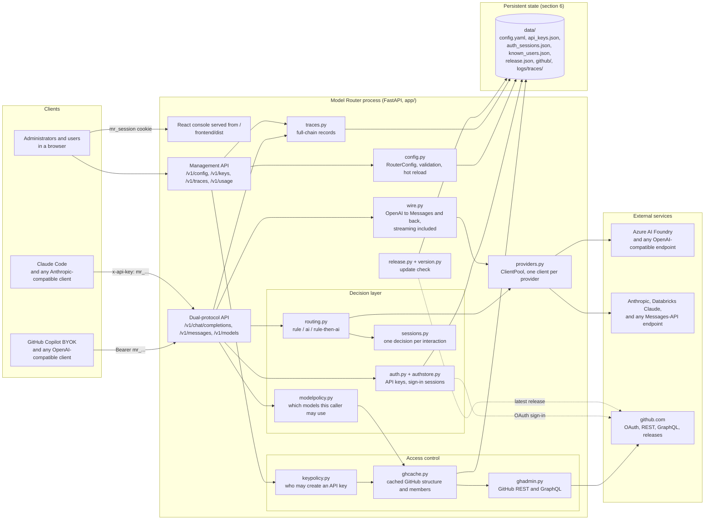

Two properties of this shape are deliberate:

- **The provider is per model, not per deployment.** `ClientPool` caches a client per
  `(base_url, api_key, api_type, api_version, kind)`, so one router can serve models that live on
  different endpoints with different keys, and the AI decision model can have a connection of its
  own. See [Backend connections](providers.md).
- **The client protocol and the backend protocol are independent.** Everything between the two edges
  works in one canonical form, OpenAI chat completions, and `wire.py` converts at the edges only. So
  an Anthropic-style client can be answered by an Azure deployment and an OpenAI-style client by a
  Claude endpoint, and a new routing feature is written once rather than twice.
- **GitHub is never on the critical path of a model call when it can be avoided.**
  `ghcache.py` answers membership questions from a locally cached member list and only falls
  through to a live probe when that list is missing, stale or truncated. See
  [Access control](access-control.md).

## 2. The request path

What one call does, in order. Both entry points funnel into the same path, so this sequence
describes `POST /v1/messages` too; only the two conversion steps differ.
`interaction-sticky` and `session-sticky` are the two paths that skip the routing decision entirely.

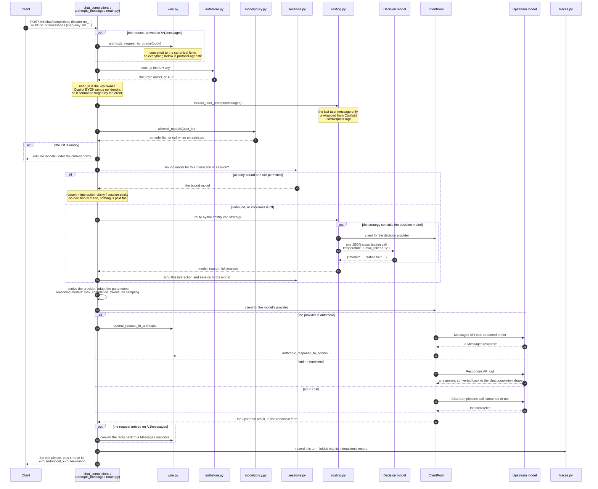

The response headers are the cheap way to see what happened without opening the console:
`x-trace-id`, `x-routed-model`, `x-router-reason`, `x-router-decision-ms`, and
`x-router-interaction-id` when the request carried one.

**One user interaction is one record.** An agentic client answers a single question with a loop of
requests, each replaying the whole conversation under the same interaction id. Those requests
become successive `turns` inside one trace file rather than N separate records, and the model stays
constant across the loop:

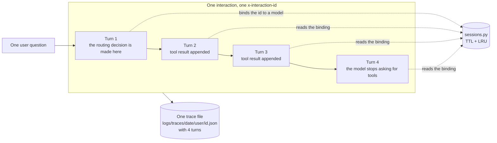

## 3. The routing strategies

Three strategies, set by `strategy` in `config.yaml` and editable on the console's "Routing
configuration" page. Every branch below writes its evidence into the trace's `routing.analysis`, so
the console can show which rule was evaluated, what the decision model was sent and what it
answered.

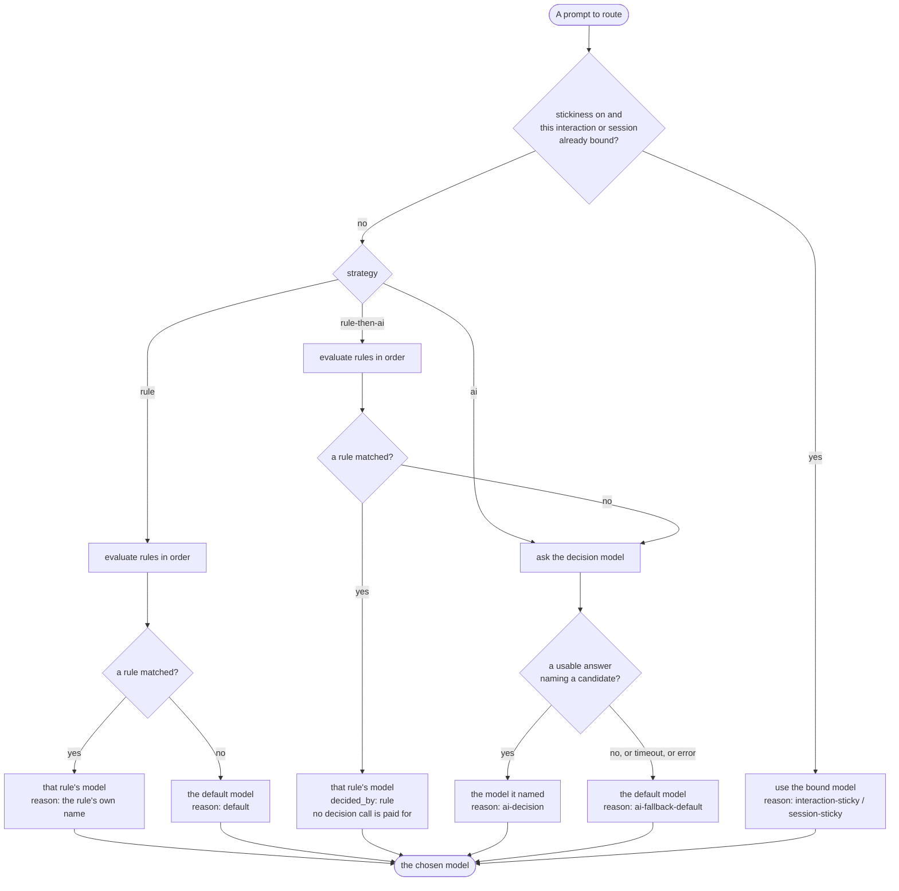

How a single rule is evaluated, and why a rule can be skipped:

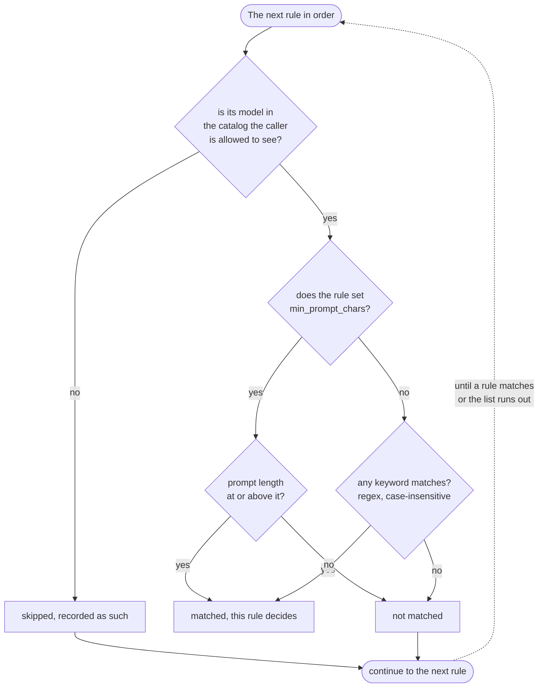

A rule that matched on `min_prompt_chars` wins exactly as a keyword rule does. Under
`rule-then-ai` this matters: a rule is the operator stating an explicit intent, and an explicit
intent is not handed to a classifier that cannot legitimately overrule it.

What the decision model is and is not sent, which is the reason an AI decision stays cheap:

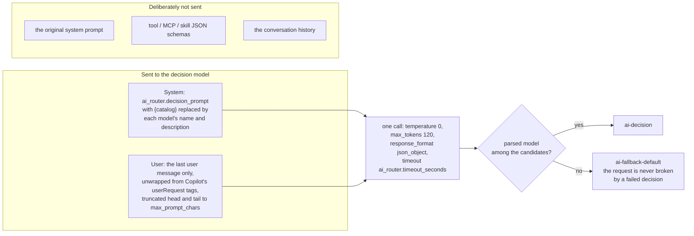

Truncation keeps the **head and the tail** of an over-long prompt with the middle omitted, because
the real question in an agent's prompt is usually at the very end and a head-only cut would remove
exactly the part being classified.

## 4. Which models a caller may use

Named model groups are bound to user, team and organization scopes and resolve as a **union**. The
result narrows the catalog *before* anything routes, so a model a caller may not use is unreachable
through a rule, through the decision model and through the default-model substitution alike.

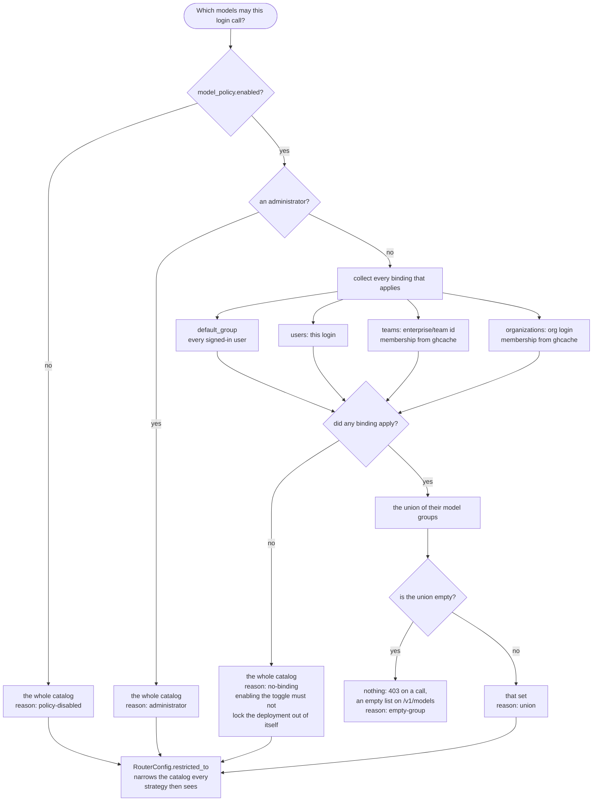

Because the result is a union, a binding can only ever *add* models. There is no scope that takes
models away, which is what lets an operator widen a group without auditing every narrower binding
first. A membership lookup that cannot be answered fails **open** for that one scope: it simply
does not contribute, because silently showing a user fewer models than they were granted is worse
than briefly including a scope they may have left.

## 5. Identity and authorization

Two independent identity sources, and one gate that decides who may obtain the credential the API
actually accepts.

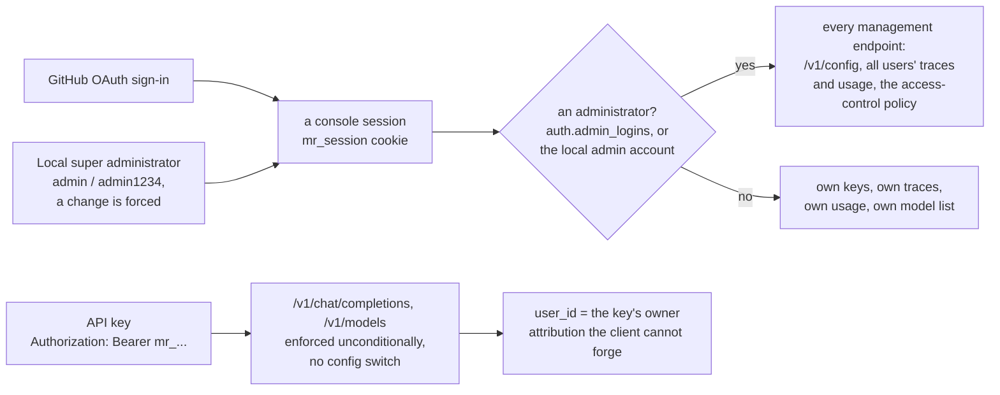

A session and an API key are separate credentials for separate surfaces: the cookie reaches the
console and the management API, the key reaches `/v1` and nothing else. Copilot BYOK sends no user
identity of its own, which is exactly why attribution is taken from the key's owner rather than
from anything in the request body.

Obtaining a key is the gated step:

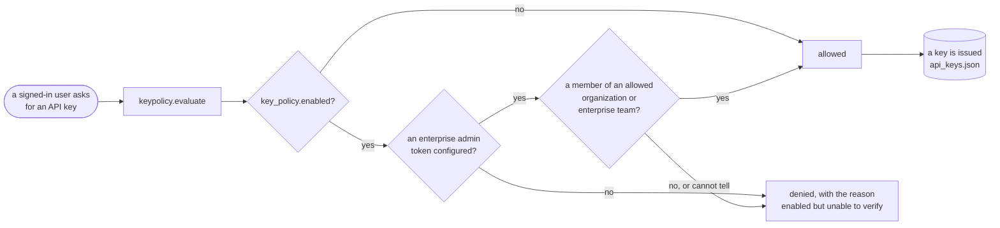

The gate is **fail-closed**, because withholding one key is better than issuing one wrongly, while the
model policy of section 4 is fail-open per scope. The difference is deliberate: one is a privilege
boundary, the other is a distribution control. That is also why "enabled but unable to verify"
denies: a policy switched on must not leave the deployment less protected than switching it off.

Membership answers come from the local cache first:

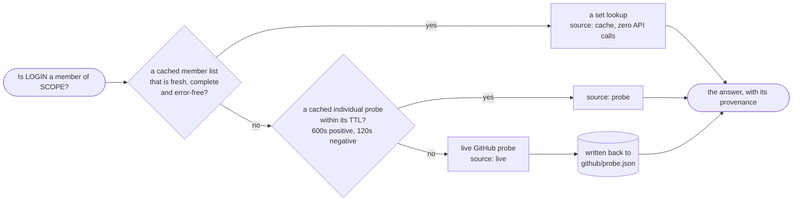

A truncated or errored member list is never authoritative: "not in the pages I could read" is not
"not a member", and treating it as one would deny legitimate users. Short negative TTLs are the
other half of that: a user added to an organization gets in quickly instead of being re-probed on
every request until a full refresh happens.

## 6. Persistent state and background tasks

Everything the router persists lives under one directory. That is the whole state of a deployment:
one directory to back up, copy to another machine, or mount into a container.

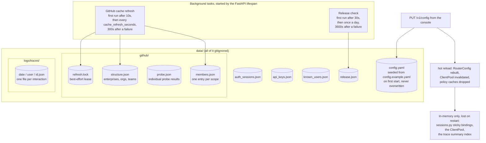

Both loops are wrapped per iteration, so a GitHub outage cannot kill either task, and a background
task that dies silently is worse than no background task, because the cache would simply stop
ageing forward and nobody would be told. Neither is required for routing: a router that cannot
reach github.com keeps serving requests, keeps the last cached answers, and shows no update chip.

The lease matters only when several workers share one `data/` directory. It makes a duplicate
refresh unlikely, and the atomic writes make a duplicate refresh merely wasteful rather than
corrupting, which is why a best-effort lease is enough and a real lock is not warranted.
