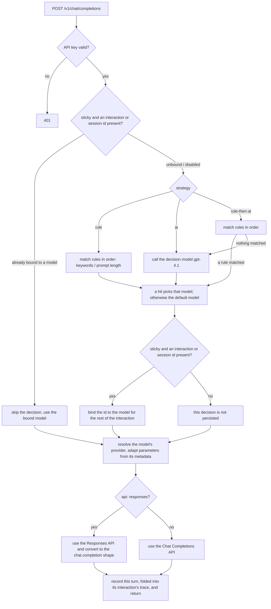

# Router logic

This is the step-by-step walkthrough of the request path. For the wider picture — the components,
the persistent state, and each routing strategy drawn as a decision tree — see
[Architecture and data flow](architecture.md).

Every request that reaches `chat_completions` in [app/main.py](../app/main.py) is handled in this
order:



**0. Authentication and attribution**: the API key is validated first
([app/auth.py](../app/auth.py)), and the key's owner becomes this request's `user_id`.

**1. Stickiness — one decision per user interaction**: with `session.sticky: true` in `config.yaml`,
the in-memory binding store ([app/sessions.py](../app/sessions.py), TTL + LRU) is consulted before
any decision is made. A hit reuses that model directly, skipping the routing decision entirely —
zero latency, zero decision cost, reported as `interaction-sticky` / `session-sticky` in the trace's
`reason`.

Two keys are checked, in this order:

| Key | Header | Scope |
|---|---|---|
| Interaction | `x-interaction-id` (or `x-conversation-id` / `x-copilot-interaction-id`) | one user question, including every request of the tool-call loop that answers it |
| Session | `x-session-id` | a whole conversation, opt-in, set by the caller |

The interaction key is what makes an agentic client cheap. **GitHub Copilot answers a single user
question with a loop of HTTP requests**: it calls the model, runs the tool the model asked for,
appends the result and calls again, until the model stops asking for tools. Every one of those
requests replays the whole conversation and carries the **same** `x-interaction-id` (only
`x-request-id` differs). Without this key each one is an independent request that re-routes the same
original prompt — for a four-call loop that was ~8 s of pure added latency and 4× the decision-model
tokens, for a decision that could not legitimately come out differently. With it, the model is
chosen once and held for the rest of the interaction.

**The Copilot CLI over BYOK sends none of these headers** (Go backend). It talks through the stock
OpenAI SDK, and neither its headers nor its body carry a session or interaction id. What it does send
is `x-initiator`: `user` on the turn a person typed, `agent` on every follow-up of the tool-call
loop. Every turn of one loop also resends the same last user message, including the
`<current_datetime>` stamp the CLI puts in it. So when a request carries `x-initiator` but no
interaction header, the router derives the interaction id itself: `derived-` plus a hash of the API
key and that message. The loop is then routed once and recorded as one trace, the next question
(a new message with a new stamp) gets a fresh decision, and two CLI sessions on the same key stay
apart.

A client that sends neither an interaction header nor `x-initiator` is unaffected: every request is
then its own interaction.

**2. Rule routing (`strategy: rule`)**: the `rules` list in `config.yaml` is evaluated **in order**
(`route_by_rules` in [app/routing.py](../app/routing.py)):
   - if a rule configures `min_prompt_chars`, the prompt length is checked against it;
   - otherwise the `keywords` are matched against the prompt (regex, case-insensitive);
   - the first matching rule decides the model; later rules are not evaluated;
   - if nothing matches, the model marked `default: true` under `models` is used.
   No LLM call at all — under 1 ms.

**3. AI routing (`strategy: ai`)**: a lightweight decision model (`ai_router.decision_model`,
`gpt-4.1` by default) performs a single-turn JSON classification (`route_by_ai`). **What is actually
sent to the decision model**:
   - **System**: rendered from `ai_router.decision_prompt` — the `{catalog}` placeholder in the
     template is replaced with the model catalog (each model's name + `description`, from
     `config.yaml`). That field **can be edited on the console's "Routing configuration → Routing
     strategy" page**, with a preview rendered against the real model catalog (see below); omitting
     it or leaving it empty uses the built-in default prompt (which requires a bare
     `{"model": "...", "rationale": "..."}` response);
   - **User**: only the body of the **last user message** in the original request
     (`extract_user_prompt`). If that message contains Copilot-style
     `<userRequest>...</userRequest>` tags (terminal state, workspace structure and other context
     sit outside the tags), only the real question inside the tags is extracted, so the decision is
     not drowned in irrelevant context;
   - **Not included**: the original request's full system prompt, the JSON Schema of
     `tools`/MCP/skills, and the conversation history — none of it helps classification, and all of
     it would add significant decision latency and cost;
   - anything longer than `ai_router.max_prompt_chars` (4000 by default) is truncated **keeping both
     halves** (the start and the end of the question, with the middle omitted) rather than simply
     cut at the head, so a real request placed at the very end is not lost;
   - call parameters: `temperature=0`, `max_tokens=120`, `response_format=json_object`, timeout
     `ai_router.timeout_seconds` (5 s by default). The decision model also goes through the provider
     pool, and `ai_router.decision_provider` can give it its own connection.
   - if the returned `model` is not among the candidates, or the call times out or errors, routing
     **silently falls back** to the default model (`ai-fallback-default`) without affecting the main
     request.
   - the system content actually sent is written in full to the trace's
     `routing.analysis.decision_system` — the prompt is editable, so without recording it there is
     no way to tell later which version a historical request used.

   **Editing and previewing the prompt**: the "AI decision prompt" panel on the console's "Routing
   configuration → Routing strategy" page provides a template editor and an **actual prompt
   preview**. The preview is produced by the backend at `POST /v1/config/decision-prompt/preview`,
   through the very same rendering function `route_by_ai` uses
   (`RouterConfig.render_decision_prompt`), so the preview is **character-for-character identical**
   to a real request rather than an approximation reassembled in the frontend. The unsaved draft
   (models / ai_router) is sent along with the request, so editing a model's `description` shows up
   in the preview without saving first. Also:

   - substituting `{catalog}` is a **literal replacement, not `str.format`** — a prompt almost
     inevitably contains JSON braces, and `format` would treat `{"model": ...}` as a placeholder and
     raise, so **braces need no escaping**;
   - when the template has no `{catalog}`, the catalog is **appended at the end** (guaranteeing the
     decision model at least sees the candidates), and the UI says so;
   - the panel lists models with no `description` — in the catalog they are just a name, and the
     decision model can hardly tell whether to pick them;
   - you can type a sample request to preview what the user message looks like after being truncated
     to `max_prompt_chars`.

   **The TypeSafe Jev decision engine (optional, Go backend)**: ticking "Use a System One decision
   model" on the same page and choosing **TypeSafe Jev (hosted API)** sets
   `ai_router.decision_engine: typesafe`, and the decision is
   made by [TypeSafe's Jev](https://typesafe.ai/blog/introducing-system-one-models-and-jev) instead
   of an LLM. Jev is a "System One" model built to pick one option out of a closed set, which is
   exactly the routing question — measured end to end from this router it answers in ~300 ms, against
   ~1.3–1.9 s for `gpt-4.1-mini` on Azure OpenAI. Unticking it goes back to the LLM path; nothing
   else about routing changes.

   ```yaml
   ai_router:
     decision_engine: typesafe      # omitted / "llm" = the LLM decision model above
     typesafe:
       api_key: ts_...              # or leave empty and set TYPESAFE_API_KEY in the environment
       model: jev-latest            # optional; pin e.g. jev-1.13.0 for stable behaviour
       base_url: https://api.typesafe.ai   # optional
   ```

   - **What is sent**: one `POST /v1/systemone` with the (truncated) user prompt as the `state`
     (`{"user_request": "..."}`) and a single **Choice** question whose options are the model catalog,
     each model's `description` serving as that option's rubric. `decision_prompt`, `decision_model`
     and `decision_provider` are not used (they are kept in the config for switching back), so with
     Jev the `description`s are what steer the decision. The preview panel shows this exact request.
   - **What is recorded**: the trace's `routing.analysis` carries `decision_engine: typesafe`, the
     versioned model that answered (`decision_model_version`, e.g. `jev-1.13.0`), the question asked
     (`decision_question`), the full calibrated `probabilities` over the catalog and a `confidence`
     — which show how close the runner-up was, something the LLM's one-line rationale cannot.
   - **Unchanged**: `timeout_seconds`, `max_prompt_chars`, the `rule-then-ai` handover, model-policy
     narrowing (Jev only ever sees the caller's allowed models), stickiness, and the fallback — an
     error, a timeout, an answer outside the catalog, or a catalog with fewer than 2 or more than 255
     models all fall back to the default model (`ai-fallback-default`) with the reason in the trace.
   - Jev reads English best; model descriptions written in English give the most reliable picks.

   **Self-hosted Laya (optional, Go backend)**: [Laya](https://github.com/NandhaKishorM/laya) is an
   open-source alternative to Jev. Its `laya-serve` exposes the same `POST /v1/systemone` protocol, so
   choosing **Self-hosted Laya** under the same checkbox (`ai_router.decision_engine: laya`) sends the
   exact request described above to your own server instead of TypeSafe's.

   ```yaml
   ai_router:
     decision_engine: laya
     laya:
       base_url: http://127.0.0.1:8100   # required: where laya-serve listens
       api_key: laya_...                 # only if laya-serve was started with LAYA_API_KEY
       model: english                    # optional: english / multilingual / typed-decisions;
                                         # omit to let Laya pick by the request's language
   ```

   - **What differs from Jev**: without a pinned checkpoint the request carries no `model` field, and
     Laya routes English text to its `english` checkpoint and other languages to `multilingual`. The
     trace records which one answered (`decision_checkpoint`). The key is optional, and is never the
     TypeSafe key. A Choice question may carry at most 100 options, so a catalog larger than that
     falls back to the default model.
   - **Accuracy.** Laya's base checkpoints are not fine-tuned for model routing. In our test against
     a 5-model catalog, Laya picked the expected model for 7 of 9 prompts, with flat probabilities
     (confidence 0.02–0.41), where Jev picked all of them with confidence above 0.85. Laya's own README
     says its base checkpoints are weak zero-shot and meant to be fine-tuned. Its `confidence` is also
     computed differently (1 minus normalised entropy), so thresholds don't carry over from Jev.
   - **Speed and cost.** On an Apple M4 Pro a warm decision takes about 30–200 ms, with no per-call
     cost, and the prompt never leaves your network.
   - Everything else is shared with Jev: the fallback to the default model on any error (a wrong key
     answers `401: invalid or missing bearer token` in the trace), stickiness, and model-policy
     narrowing. The TypeSafe and Laya settings are both kept when you switch between them.

**4. Both at once (`strategy: rule-then-ai`)**: the rules and the decision model are **both** active
(`route_combined`). The rules are evaluated first, exactly as in step 2; a match returns that rule's
model immediately and **no decision call is made**. Only a request no rule matched is handed to the
decision model, which then behaves exactly as in step 3 — including its own fallback to the default
model on a timeout or an unusable answer. So an unmatched request is the only one that costs a
decision call, and the default model is reached only through the AI branch's fallback, never directly.

A rule that matched on `min_prompt_chars` wins just as a keyword rule does: it is equally an explicit
instruction from the operator, and making the Rules page authoritative for some of its own rows and
merely advisory for others would be impossible to reason about from the UI.

The trace's `routing.analysis` **nests both stages** rather than flattening them:

```json
{
  "type": "rule-then-ai",
  "decided_by": "ai",
  "rule": { "type": "rule", "evaluated": [...], "fallback": "no rule matched, handing over to the AI decision model" },
  "ai":   { "type": "ai", "decision_system": "...", ... }
}
```

`decided_by` names the stage that produced the model, and each sub-analysis keeps the `type` its
single-strategy counterpart emits, so the console renders the handover with the renderers it already
has. **`ai` is absent exactly when a rule fired** — which is itself the evidence that no decision call
was paid for.

**5. Parameter adaptation**: the model's provider and upstream model name (`model_name`) are
resolved, then the `models.<name>.reasoning` / `models.<name>.api` flags are applied:
   - `reasoning: true` (newer reasoning models such as the gpt-5.x / o3 families): `max_tokens`
     becomes `max_completion_tokens`, and sampling parameters such as `temperature` / `top_p` are
     stripped (those models do not support them);
   - `api: responses`: the Responses API is used (`/openai/v1/responses` on Azure) instead of Chat
     Completions, and the result is adapted back to the standard `chat.completion` shape; a
     streaming request is returned as one SSE chunk.

**6. Writing the sticky binding back**: if a real decision was made (not a sticky hit) and
stickiness is enabled, both keys the request carried — `interaction_id → model` and
`session_id → model` — are written to the in-memory store for the rest of that interaction, and any
later request of that session, to reuse.

**7. Recording the turn**: the request is closed out as one *turn* and handed to
[app/traces.py](../app/traces.py), which folds it into the trace of the interaction it belongs to
rather than opening a record of its own — see [Full-chain logging](traces.md).
