# Operations guide

**English** · [简体中文](user-guide-cn.md)

A walkthrough of the console for the two people who use it: the **administrator** who sets the
router up and keeps it running, and the **standard user** who signs in, gets a key and points a
client at it. Every screenshot below is the real console, taken at version 1.0.0 with the language
set to English.

Read it in order the first time. The administrator sections come first because a standard user has
nothing to do until a backend connection, a model catalog and a key policy exist.

---

## 1. System overview

### 1.1 What it does

Model Router accepts OpenAI-compatible requests at `POST /v1/chat/completions` and forwards each one
to a **suitable** backend model instead of a fixed one. "Suitable" is decided either by rules you
write, by a small decision model, or by both together, and every decision is recorded in full so it
can be inspected afterwards.

| Capability | Where it lives in the console |
|---|---|
| Route by rules, by an AI decision, or both | Routing configuration → Routing strategy / Rule routing |
| Serve models from several backends at once, Azure AI Foundry or any OpenAI-compatible endpoint | Routing configuration → Backend connections |
| One routing decision per user interaction, not per HTTP request | Routing configuration → Routing strategy (session stickiness) |
| Attribute every call to a real person | API keys (a key's owner becomes the caller's identity) |
| Gate who may create a key, by GitHub Enterprise / organization / Enterprise Team | Access control → Key policy |
| Curate which models each user, team or organization may call | Model policy |
| Inspect the request, the decision, the backend call and the response | Traces |
| Counts, tokens, error rate and latency, per model, per day, per user | Usage |

### 1.2 How it works

One process. It serves the console at `/`, an API under `/v1` that speaks **both** the OpenAI
chat-completions protocol and the Anthropic Messages protocol, and keeps all of its state in a single
`data/` directory: no database, no cache server, no queue. A request goes
through authentication, the model policy, the sticky-binding check, the routing strategy, parameter
adaptation for the chosen model, the backend call, and finally the trace record.

The diagrams are in [Architecture and data flow](architecture.md); the step-by-step narrative of the
request path is [Router logic](router-logic.md). This guide is the operational view of the same
system: which button to press, in which order, and what the screen says afterwards.

### 1.3 Concepts worth knowing before you click anything

| Concept | What it means here |
|---|---|
| **Connection** (provider) | One backend address plus its key, and the interface type it speaks: Azure OpenAI, an OpenAI-compatible service, or an Anthropic-compatible service. Models bind to a connection, so one router can serve models living on different endpoints and different protocols. |
| **Protocol conversion** | The client protocol and the backend protocol are chosen independently. An OpenAI-style client can be answered by a Claude endpoint and an Anthropic-style client by an Azure deployment; the router converts request and response, streaming included. |
| **Key scope** | What a single API key may reach, inside what its owner may reach. A scope only ever narrows: `all`, or every model of chosen interface types, or an explicit list. |
| **Model catalog** | The model names a client is allowed to send. Each entry carries a description, which is what the AI decision model reads when choosing. |
| **Default model** | Used when no rule matches, and when an AI decision fails or times out. Exactly one model carries the `default` badge. |
| **Interaction** | One user question. An agentic client such as GitHub Copilot answers it with a loop of HTTP requests that all carry the same `x-interaction-id`. The router decides once for the whole loop and folds every call into one trace. |
| **Trace** | The record of one interaction: request parameters, the routing decision with its evidence, each upstream call, and the response. |
| **Key policy** | Decides **who may obtain an API key**, from GitHub Enterprise / organization / Enterprise Team membership. Fail-closed: if it cannot verify, it refuses. |
| **Model policy** | Decides **which models an already-authorized caller may use**. Named model groups are granted per scope and resolve as a union. Fail-open per scope, and no binding at all means unrestricted. |

The two policies are independent and answer different questions. Key policy is a privilege boundary
("may this person call the API at all"); model policy is a distribution control ("which of the models
should this person see"). That is why one refuses when in doubt and the other does not.

### 1.4 The console: roles, top bar, navigation

There are two roles. **Administrators** are the GitHub logins listed under Access control, plus the
local administrator account. **Standard users** are everybody else who can sign in.

The top bar is the same for both:


From left to right: the navigation toggle, the product name with the running version, a link to the
source repository, a link to file an issue, the live status chip (`Running · <strategy> · sticky`),
the console language, the light/dark theme toggle, and your own account menu. If a newer release
exists on GitHub, an update chip appears here too.

An administrator sees three navigation groups:

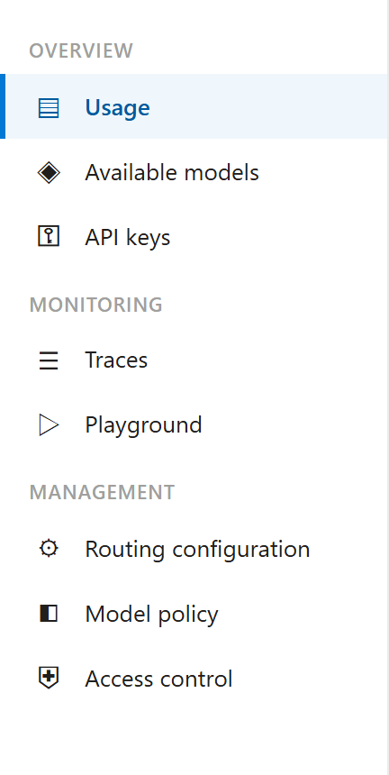

A standard user sees the first two only. The whole MANAGEMENT group is absent, and the endpoints
behind it refuse a non-administrator session regardless of what the browser asks for:

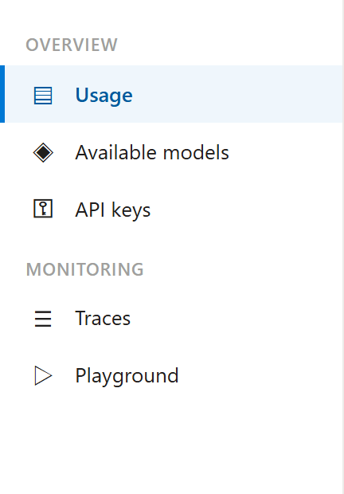

---

## 2. Administrator guide

### 2.1 First sign-in

Open `http://<host>:8000/`. The sign-in screen offers whichever doors are configured:

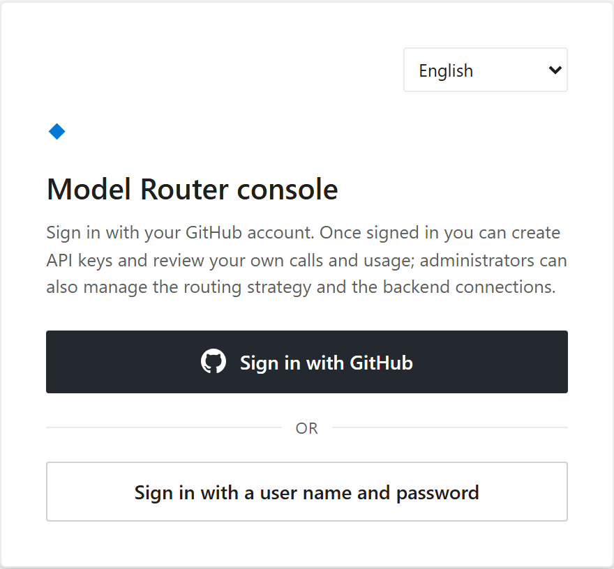

- **Sign in with GitHub** appears once a GitHub OAuth application is configured.
- **the local administrator account** is the door that does not depend on github.com. In a fresh
  container it is the only one, because the setup wizard for OAuth is offered only to requests coming
  from `127.0.0.1`.

Click the local option and the user name / password form appears:

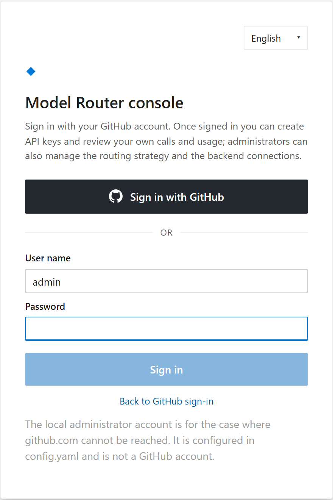

The built-in credential is **`admin` / `admin1234`**. Signing in with it takes you straight to a
forced password change, and *nothing else in the console or the management API is reachable* until
the password is changed. A super administrator on a published default password must not be usable.
The new password must be at least 8 characters and must not be the built-in default.

> **If you are locked out later**: clear `password_hash` and `password_salt` under
> `auth.local_admin` in `data/config.yaml`. The built-in default applies again and the console will
> force another change on the next sign-in.

Once you are in, the four configuration steps under **Routing configuration** are presented in the
order they depend on each other, each linking to the next.

### 2.2 Step 1 · Backend connections

**Routing configuration → Backend connections.** Nothing else works until at least one connection is
saved: a model with no reachable address cannot be called.

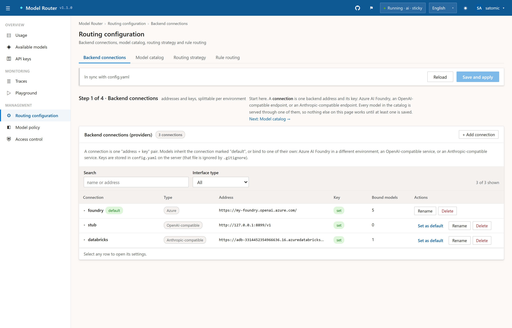

1. Click **+ Add connection** and give it a name (`foundry`, `stub`, `eu-west`; the name is only
   used to bind models to it).
2. **Address (base_url)**, per interface type:
   * `azure`: the resource root, `https://<resource>.openai.azure.com/`.
   * `openai`: all the way to `/v1`, e.g. `http://127.0.0.1:8899/v1`.
   * `anthropic`: the host that serves `/v1/messages`, e.g.
     `https://<workspace>.azuredatabricks.net/serving-endpoints/anthropic`.
3. **Key (api_key)**: written to `data/config.yaml` on the server when you save. Use **Show** to
   reveal what is currently stored. For an `anthropic` connection this is the value the endpoint
   expects in the `x-api-key` header.
4. **Interface type (api_type)**: `azure` for Azure OpenAI / AI Foundry, `openai` for any other
   OpenAI-compatible service, `anthropic` for a service that speaks the Messages API (Anthropic
   itself, Databricks Claude serving endpoints, Bedrock-style gateways that expose the same shape).
   The version field beside it changes meaning with the type: for `azure` it is the `?api-version=`
   query parameter (default `2024-12-01-preview`), for `anthropic` it is the `anthropic-version`
   request header (default `2023-06-01`), and `openai` has no version at all. Switching the type
   clears the field on purpose, because an Azure version string sent as an `anthropic-version`
   header is rejected upstream.
5. One connection carries the `default` badge; models that do not name a connection of their own
   inherit it. Use **Set as default** on another row to move it.
6. Press **Save and apply**. The bar above the panels tells you whether the page is *In sync with
   config.yaml* or holds unsaved edits, and **Reload** discards a draft.

Saving reloads the configuration in place: the router rebuilds its client pool, so a corrected key
takes effect on the next request without a restart.

**The interface type is a backend detail, not a client contract.** Callers never have to match it.
The router accepts requests on both protocols and converts to whatever the chosen model's connection
speaks, in all four combinations:

| Client sends | Backend connection | What the router does |
|---|---|---|
| `POST /v1/chat/completions` | `azure` / `openai` | passes through |
| `POST /v1/chat/completions` | `anthropic` | converts the request to Messages, converts the reply back to a chat completion |
| `POST /v1/messages` | `anthropic` | passes through |
| `POST /v1/messages` | `azure` / `openai` | converts the request to chat completions, converts the reply back to a Messages response |

Streaming is converted the same way, event by event, so a streaming client sees its own protocol's
events regardless of which backend answered. Each trace turn records both sides as `client_protocol`
and `protocol`, which is how you tell after the fact whether a conversion happened.

More detail, including the non-Foundry cases: [Backend connections](providers.md).

### 2.3 Step 2 · Model catalog

**Routing configuration → Model catalog.** These names are the ones a client may put in the `model`
field of a request.

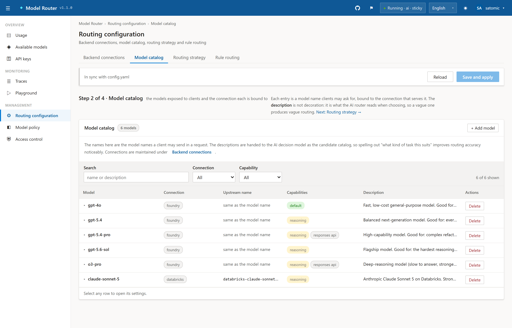

For each model:

1. **+ Add model** and enter the name the router exposes (`gpt-4o`, `gpt-5.4-pro`, …).
2. **Description**: worth real effort. It is handed to the AI decision model as the candidate
   catalog, so a description that spells out *what kind of task this model suits* improves routing
   accuracy noticeably. A model with no description is just a name to the decision model.
3. **Connection (provider)**: *Follow the default*, or bind this one model to another connection.
4. **Upstream name override (model_name)**: only when the deployment name upstream differs from the
   name you expose.
5. **Default model**: exactly one. It is used when no rule matches and when an AI decision fails.
6. **Reasoning model**: tick it for the gpt-5.x / o3 families. The router then sends
   `max_completion_tokens` instead of `max_tokens` and strips sampling parameters such as
   `temperature`, which those models reject. Tick it for a Claude model too when its endpoint
   refuses sampling parameters: Databricks Claude serving endpoints reject `temperature` outright,
   and without this flag every call through them fails with an upstream 400.

Deleting a model also cleans up after itself: the console reports how many rules and model groups
referenced it and were updated.

### 2.4 Step 3 · Routing strategy

**Routing configuration → Routing strategy.** Three strategies, plus the stickiness and
decision-model settings.

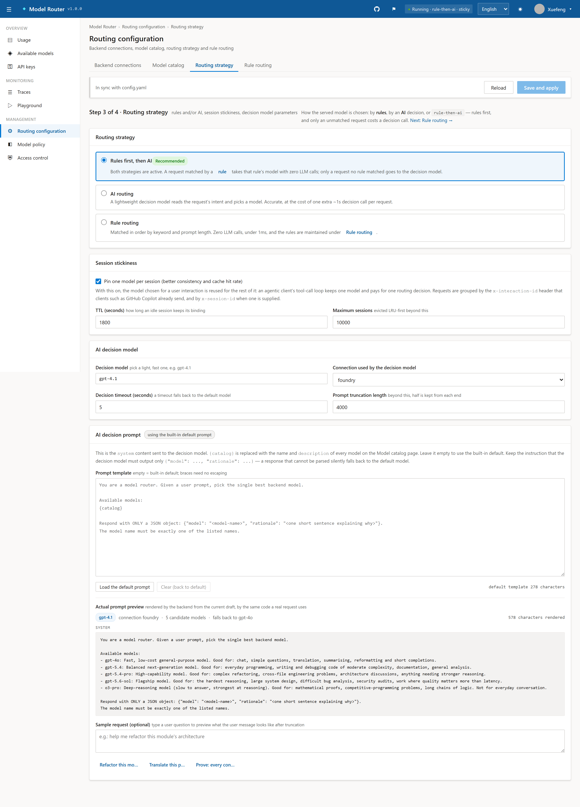

| Strategy | Behaviour | Cost |
|---|---|---|
| **Rules first, then AI** (recommended) | Rules are evaluated first; a match takes that rule's model. Only an unmatched request reaches the decision model. | An LLM call only for requests no rule covers |
| **AI routing** | The decision model reads the intent of every request and picks. | One extra ~1 s call per request |
| **Rule routing** | Keyword and prompt-length matching in order; the default model when nothing matches. | Zero LLM calls, under 1 ms |

**Session stickiness** is the setting with the largest practical effect. With it on, the model chosen
for an interaction is reused for the rest of it: an agent's tool-call loop keeps one model and pays
for one routing decision instead of N. Requests are grouped by the `x-interaction-id` header that
clients such as GitHub Copilot already send, and by `x-session-id` when a caller supplies one. TTL
controls how long an idle binding survives; **Maximum sessions** caps the store, evicting
least-recently-used first.

**AI decision model**: pick something light and fast (`gpt-4.1`), optionally give it its own
connection, and set the decision timeout (a timeout falls back to the default model rather than
failing the request). **Prompt truncation length** bounds what is sent for classification; beyond it
half is kept from each end, because the real question in an agent's prompt is usually at the very end.

**The decision prompt** is editable on this page, with a preview rendered by the backend through the
very same function the router uses, so the preview is character-for-character what a real request
would send, not an approximation. The panel also lists models that have no description, since those
are the ones the decision model cannot reason about.

### 2.5 Step 4 · Rule routing

**Routing configuration → Rule routing.** Rules are the cheap, explicit half of routing.

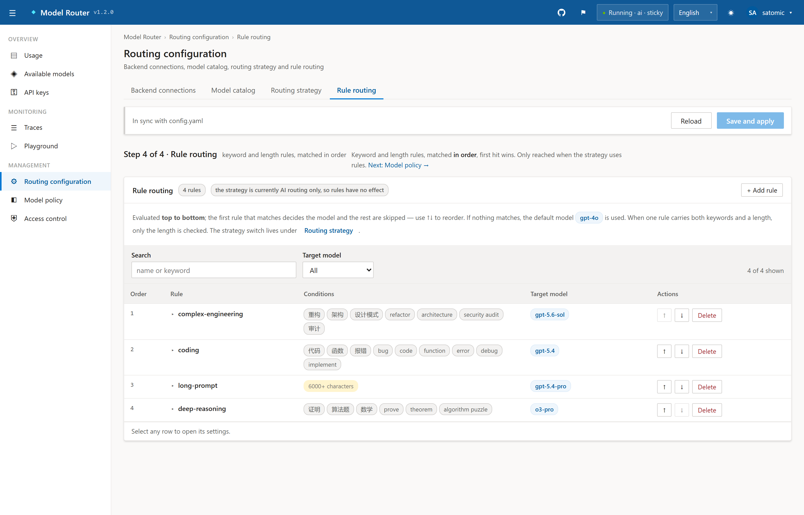

- Rules are evaluated **top to bottom**; the first match decides the model and the rest are skipped.
  Use the arrow buttons to reorder.
- **Keywords** are comma-separated, case-insensitive, matched as regular expressions against the
  prompt; any one match routes.
- **Minimum prompt length** routes on size instead. When a rule carries both, only the length is
  checked.
- Each rule names the model it routes to, and can be switched off without being deleted.
- What happens when nothing matches depends on the strategy, and the page says which: under *rule
  routing* the default model is used; under *rules first, then AI* the request goes to the decision
  model instead.

A rule is you stating an explicit intent, so a rule that fires is never second-guessed by the
decision model.

### 2.6 Model policy: which models each caller may use

**Model policy** (a first-level page under MANAGEMENT). Model groups are named sets of models,
granted to scopes; the result is the union of everything that applies to a caller.

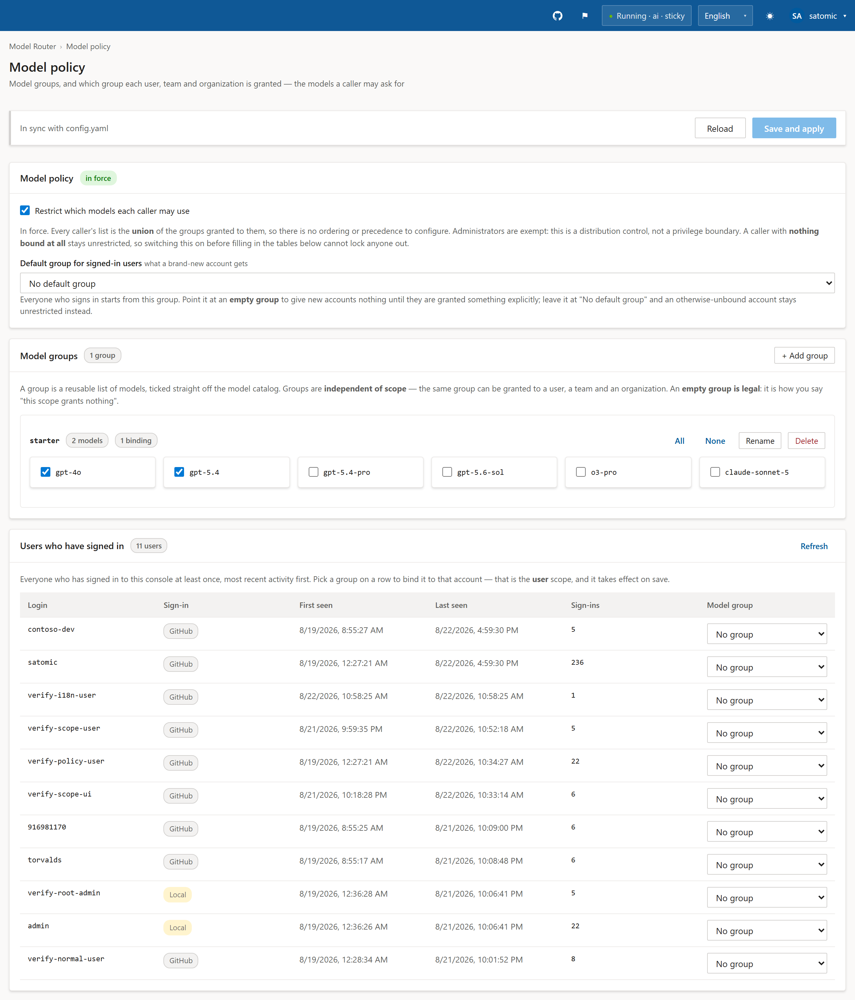

1. Tick **Restrict which models each caller may use** to enable the policy. While it is off, every
   caller sees the whole catalog.
2. **Model groups**: **+ Add group**, name it, then tick the models it contains. `All` / `None`
   select every box at once; `Rename` and `Delete` act on the group. An **empty group is legal** and
   means exactly what it says: a caller whose only grant is an empty group may call nothing.
3. **Default group for signed-in users** grants a group to everybody who has signed in. It is the
   natural place for "the cheap model only".
4. **Users who have signed in** lists everyone the router has seen, with first/last sign-in and
   sign-in count, and a per-user group selector. **Refresh** re-reads the list.

Team and organization grants are further down the same page:

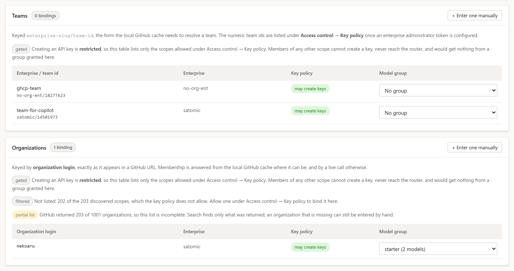

- Teams and organizations come from the structure discovered on the Access control page, so you pick
  from a list instead of typing an `enterprise-slug/team-id` key that silently matches nobody if it
  has a typo in it. **+ Enter one manually** is the fallback for a deployment with no enterprise
  administrator token.
- **Only the scopes the key policy allows are listed.** A group granted to a scope whose members
  cannot create a key grants nothing, because without a key they never reach
  `/v1/chat/completions`, so both tables offer what **Access control -> Key policy** permits and
  nothing else. The `filtered` note says how many scopes were withheld out of how many were
  discovered, so an organization you cannot find is explained on the page rather than looked for in
  a broken discovery. To bind one that is not listed, allow it under Access control first.
- A scope that is **already bound** stays listed even after the key policy stops allowing it, marked
  `no keys`, because a binding the router still enforces has to remain clearable from the page that
  owns it.
- The two empty states mean different things: *nothing discovered* points at the enterprise
  administrator token or the structure cache, while *nothing allowed* points at the key policy.
- Long lists are searchable, and a `partial list` badge appears when GitHub returned fewer
  organizations than the enterprise actually owns.
- **Save and apply** commits, exactly as on the configuration pages.

Two rules worth internalising, because they are what keeps the feature from locking a deployment out
of itself: **administrators are exempt**, and **a caller with no binding at all is unrestricted**.
Only an actual grant that resolves to an empty set denies anything. Full semantics:
[Model policy](model-policy.md).

### 2.7 Access control

Five tabs, and the order below is the order they matter in.

#### Administrators and sign-in

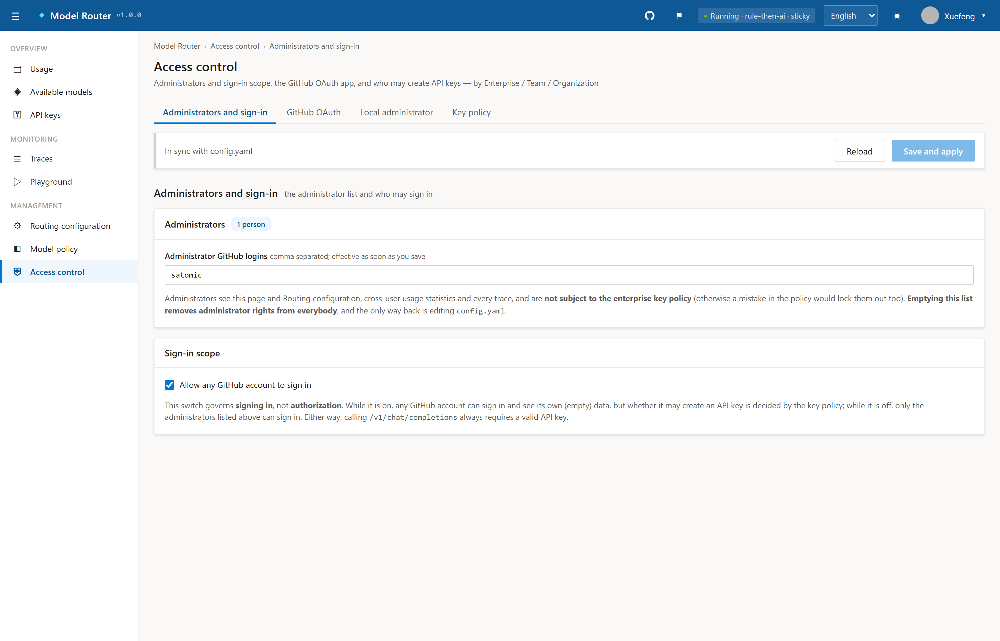

- **Administrator GitHub logins**: comma separated, effective as soon as you save. Administrators
  see the management pages, cross-user usage and every trace, and are **not subject to the key
  policy** (otherwise a mistake in the policy would lock them out too).
- **Sign-in scope** governs *signing in*, not authorization. On, any GitHub account may sign in and
  see its own (empty) data; whether it may create a key is still the key policy's decision. Off,
  only the administrators listed above can sign in. Either way `/v1/chat/completions` always requires
  a valid API key.

> **Emptying the administrator list removes administrator rights from everybody**, and the only way
> back is editing `data/config.yaml` on the server.

#### GitHub OAuth

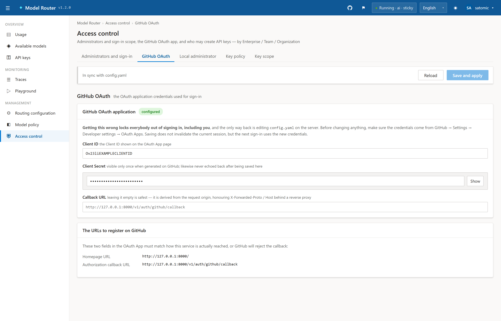

Client ID and Client Secret from GitHub → Settings → Developer settings → OAuth Apps. The panel shows
the two URLs to register on GitHub; they must match how this service is actually reached. Leaving
**Callback URL** empty is safest, because it is derived from the request origin and honours
`X-Forwarded-Proto` / `Host` behind a reverse proxy. The secret is never echoed back after being
saved; the field says `configured (leave unchanged)` when one is stored.

> **Getting this wrong locks everybody out of signing in, including you.** Keep the local
> administrator enabled while you change it.

#### Local administrator

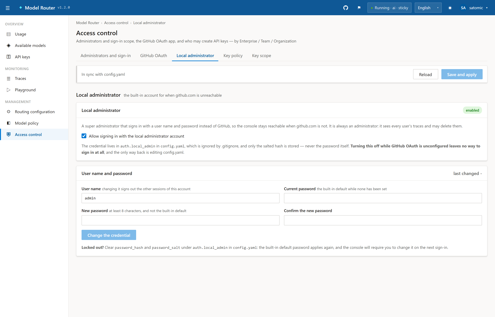

The account that does not depend on github.com. Enable or disable sign-in with it, rename it, and
change the password. Only a salted hash is stored, never the password. Changing the credential signs
out every other local-administrator session.

> **Turning this off while GitHub OAuth is unconfigured leaves no way to sign in at all.**

#### Key policy

This is the gate on API-key creation, and the page where the GitHub structure is discovered.

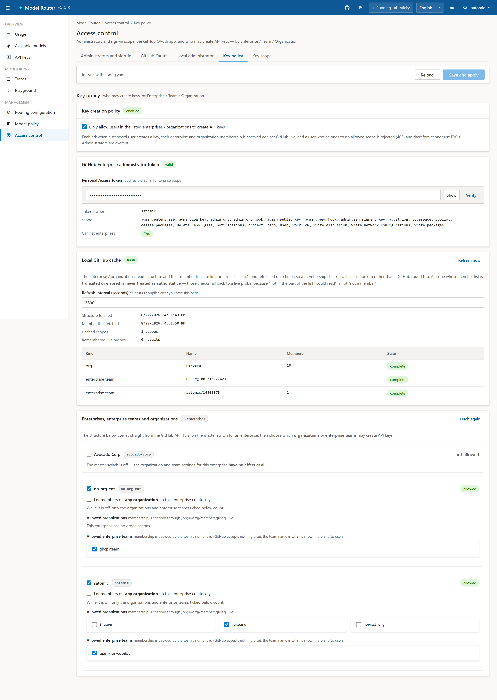

1. **Key creation policy**: tick *Only allow users in the listed enterprises / organizations to
   create API keys*. With it off, anybody who can sign in can create a key.
2. **GitHub Enterprise administrator token**: a Personal Access Token with the `admin:enterprise`
   scope. **Verify** reports the token owner, its scopes and whether it can list enterprises. Without
   a valid token an enabled policy denies everybody, by design: a policy switched on must not leave
   the deployment less protected than switching it off.
3. **Local GitHub cache**: the enterprise / organization / team structure and their member lists are
   kept under `data/github/` and refreshed on a timer, so a membership check is a local set lookup
   rather than a GitHub round trip. The card shows when the structure and the member lists were
   fetched, how many scopes are cached, and each scope's state. **Refresh now** forces a refresh.
   A scope whose member list is `truncated` or `errored` is never treated as authoritative; those
   checks fall back to a live probe, because "not in the part of the list I could read" is not "not a
   member".
4. **Enterprises, enterprise teams and organizations**: straight from the GitHub API. Turn on an
   enterprise's master switch first (while it is off, its organization and team settings have no
   effect at all), then either allow *any organization* in it, or tick individual **Allowed
   organizations** and **Allowed enterprise teams**. A row's `allowed` / `not allowed` badge is the
   effective answer.
5. **Save and apply**.

Full semantics, including how a decision is evidenced: [Access control](access-control.md).

#### Key scope

Whether a user may restrict one of their API keys to particular models or connection types. This is a
**cost** control, not a security one: a scope can only ever subtract from what the model policy
already allows its owner, so it grants nothing, but a user who scopes a key to the single most
expensive model has pinned every request on that key to it, and routing cheap work to a cheap model
stops applying to that key.

It is therefore **off by default**, and while it is off every key covers all models and all
connection types, which is what every key did before scopes existed. Switching it off later takes
nothing away from anybody.

1. **The master switch**: *Let the users, teams and organizations listed below restrict their API
   keys*. Off, the default, means nobody may.
2. **Users, Enterprise teams, Organizations**: three allow lists, filled in the same way as the model
   policy bindings. Users are ticked from everybody who has signed in; teams and organizations are
   ticked from the structure discovered by the enterprise administrator token on the **Key policy**
   tab, and can also be typed in by hand where there is no token.
3. **Save and apply**.

Each of the three tables lists only the accounts that the **Key policy** tab allows to create an API
key, and prints how many it left out. Somebody who cannot create a key has no key to narrow, so the
permission would grant them nothing. With key creation not restricted at all, every discovered
account is offered. Two exceptions keep the tables honest: an account already on an allow list stays
visible even after the key policy stops allowing it, so the entry can be seen and cleared, and an
account whose eligibility could not be established is shown as *unknown* rather than hidden. The
per-user verdict is read from the **saved** key policy, so save a key-policy edit before reading that
column; teams and organizations follow an unsaved edit immediately.

The one rule that is not guessable from three tables, and which the page states next to the switch:
the three levels are combined with **AND**, but only the ones actually filled in. Fill in users and
organizations, and a caller has to match both. Leave a list empty and it is **not consulted**, so
filling in only Organizations allows everybody in them. Within one list, any single match is enough.
Switched on with all three lists empty denies everybody, and the page says so with a *Grants nobody*
badge rather than letting an empty configuration read as *allow all*.

Administrators may always restrict a key, including somebody else's. And taking the permission away
does not rewrite keys already issued: a key that already carries a restriction keeps it, and may
still be widened back to everything, which is never refused.

Full semantics: [Who may narrow a key's scope](access-control.md#who-may-narrow-a-keys-scope).

### 2.8 Monitoring: usage, traces, playground

#### Usage

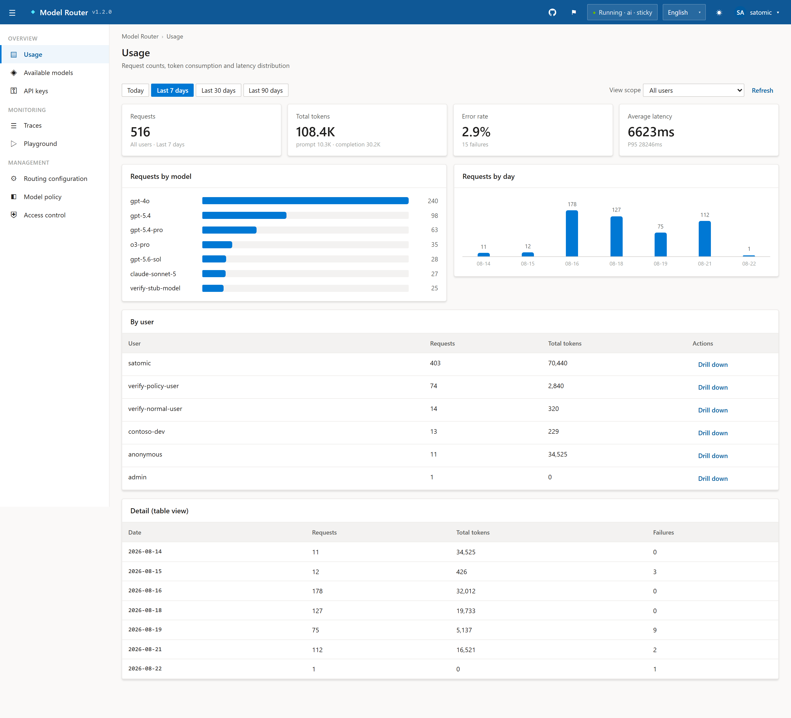

Range buttons (Today / Last 7 / 30 / 90 days) and, for administrators only, a **View scope** selector
covering all users. Four tiles (requests, total tokens with the prompt/completion split, error rate
with the failure count, average latency with P95), then requests by model, requests by day, a per-user
table with **Drill down**, and the same numbers as a table. A standard user sees this page scoped to
themselves.

#### Traces

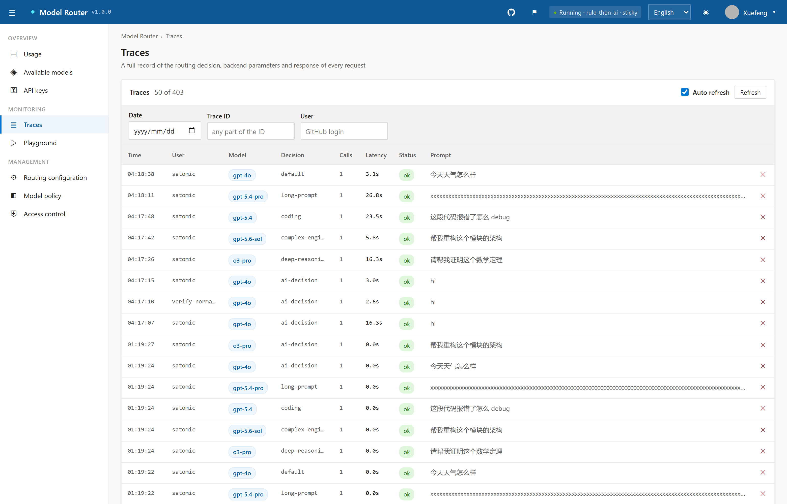

The list is read from disk and paged, so it is not limited to recent activity: the header shows
`50 of 403` and a footer loads more. Filter by **Date**, by any part of the **Trace ID**, and, as an
administrator, by **User**. **Auto refresh** reloads the first page only. The `Decision` column is
the reason the model was chosen: a rule's own name, `default`, `ai-decision`, `ai-fallback-default`,
or `interaction-sticky` / `session-sticky`. `Calls` greater than 1 means an agent tool loop.
Administrators can delete a single trace with the row's `✕`, or every trace matching the current
filters; both ask for confirmation and state the count.

Click a row and the detail pane opens beside it. Drag the divider to rebalance the columns; the
position is remembered.

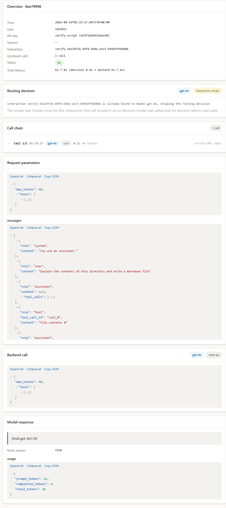

The panes are Overview (time, user, the API key that was used, interaction and session ids, the
latency split into decision plus backend), Routing decision, Request parameters, Backend call and
Model response. JSON is rendered as a collapsible, colour-coded tree with expand-all / collapse-all
and a copy button.

Under `rules first, then AI` the routing decision shows **both stages**: `1. Rules` with each rule
that was evaluated and why it did or did not match, then `2. AI decision` with the exact system
prompt that was sent, the decision input, the raw output, the rationale, the decision latency and the
decision tokens. When a rule fired, the AI stage is simply absent, which is itself the evidence that
no decision call was paid for.

An interaction that took several upstream calls shows the chain:

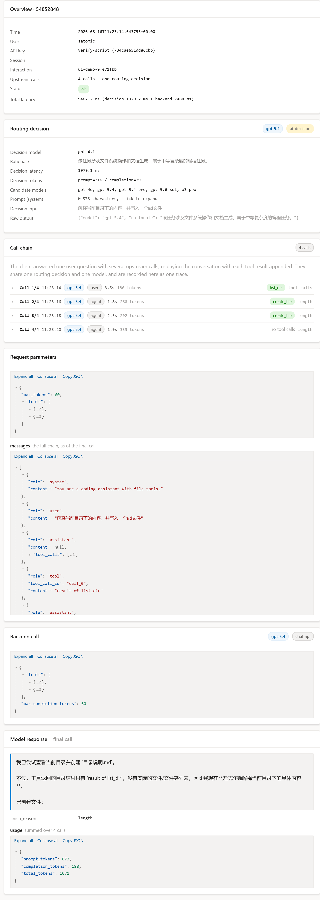

Each call carries its index, its token usage, its message count and its request id, and the pane says
plainly that they share one routing decision and one model. The reused-decision note appears on every
call after the first.

Trace format and retention: [Full-chain logging](traces.md).

#### Playground

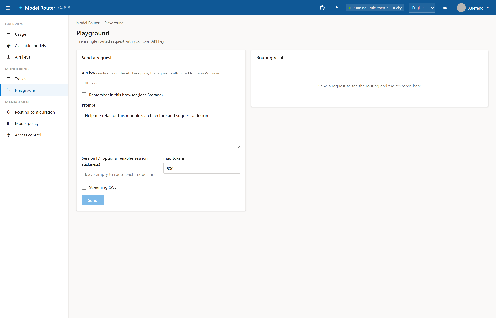

The fastest way to prove a configuration change did what you intended. Paste an API key (optionally
remembered in this browser), type a prompt, optionally set a session id to exercise stickiness, and
choose streaming or not. The **Routing result** panel names the model, the reason and the decision
latency, the response is shown below it, and **View the full trace** jumps to the trace.

The playground calls the same `/v1/chat/completions` as any other client, through the same key, so
whatever it shows is what a real caller gets.

### 2.9 A checklist for a new deployment

1. Sign in as the local administrator and change the password.
2. Add a backend connection and mark it default. *(Step 1)*
3. Add your models, write real descriptions, mark one default, tick the reasoning ones. *(Step 2)*
4. Pick a strategy and leave session stickiness on. *(Step 3)*
5. Add the rules you are certain about. *(Step 4)*
6. Configure GitHub OAuth and list the administrator logins, so people other than you can sign in.
7. Decide the key policy: enterprise token, allowed organizations and teams, or leave it off.
8. Optionally define model groups and grant them. Leave the policy off if everyone may use everything.
9. Create a key on the API keys page and send one request from the Playground.
10. Open the trace and confirm the decision reads the way you expect.

---

## 3. Standard user guide

### 3.1 Sign in

Open the router's address in a browser and choose **Sign in with GitHub**:


GitHub asks you to authorize the application once; afterwards you land on your own Usage page. Your
session is a cookie and reaches the console only; it is not a credential for the API. If sign-in is
refused, an administrator has restricted the sign-in scope to administrators; ask to be added.

### 3.2 What you can see

Two groups in the navigation, and everything in them is scoped to you:


| Page | What it shows you |
|---|---|
| Usage | your own request counts, tokens, error rate and latency |
| Available models | exactly which models you may call, and why |
| API keys | your keys, and whether you may create one |
| Traces | your own calls, in full detail |
| Playground | a request form, so you can test without writing code |

Your usage page is the same page an administrator sees, with the scope fixed to you:

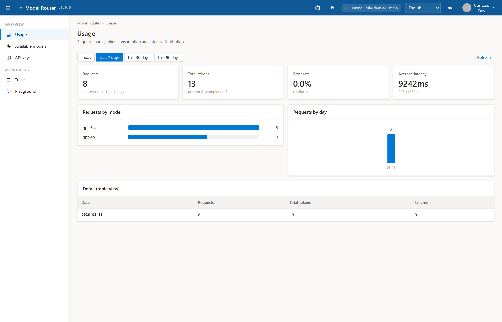

### 3.3 Which models you may call

**Available models.** This is the authoritative answer, not a guess:

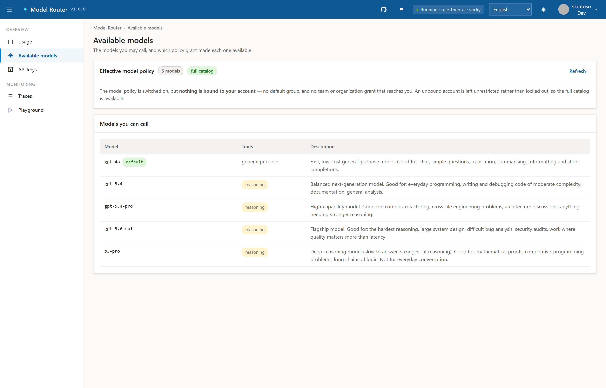

The header states the count and the reason. The reasons you may see:

| Reason | Meaning |
|---|---|
| `full catalog` / policy disabled | no model policy is in force; everything in the catalog is callable |
| `no-binding` | the policy is on, but nothing has been granted to you specifically, so you are unrestricted |
| `union` | you were granted one or more model groups, and this is their union |
| `empty-group` | your grant resolves to no models; calls will be refused until an administrator changes it |
| `administrator` | you are an administrator, and administrators are exempt |

The table lists each model you may call with its description, which is worth reading, because it is
the same text the router's decision model uses when choosing for you. The `default` chip marks the
model used when nothing else is decided; `reasoning` marks the models that ignore `temperature` and
friends.

You do not have to pick a model per request. Sending the name of *any* model in your list is enough
for the router to accept the request and route it; what you send is a hint, and the routing strategy
decides.

### 3.4 Create an API key

**API keys.** The panel at the top tells you whether you may create one, before you try:

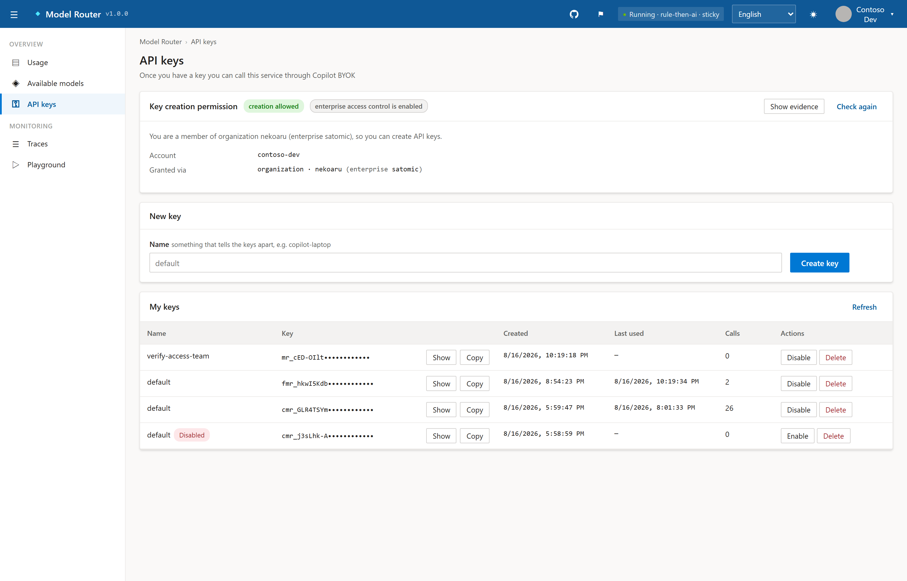

- **creation allowed**: the reason is stated ("you are a member of organization … so you can create
  API keys"), with **Granted via** naming the exact scope that let you through. **Show evidence**
  expands the per-scope detail, including whether each answer came from the local cache or a live
  GitHub probe. **Check again** re-evaluates.
- **creation not allowed**: the same panel explains why, and that is the message to quote when you
  ask an administrator for access. Nothing you can do in the console changes it.

To create a key: type a name that will remind you where it is used (`copilot-laptop`, `ci`), leave it
empty for `default`, choose a **Scope**, and press **Create key**.

The scope is what this one key may reach, and it is always evaluated *inside* what the model policy
allows you. It can only narrow, never widen, so a scope can never become a way around the policy.

**If you see *Not allowed* where the scope picker should be**, your administrator has not granted your
account permission to restrict a key, and the key you create covers all models and all connection
types. That is the default and it does not limit what you can call; ask an administrator if you
specifically want a narrower key, and quote the sentence next to the badge, because it names which
level did not match.

| Scope | What it covers |
|---|---|
| **All your models** | everything the model policy allows you, which is the default, and the only option unless an administrator granted you the rest |
| **By connection type** | every model on connections of the ticked interface types, **including models added to those connections later** |
| **Specific models** | an explicit list, ticked from your own available models |

"By connection type" is stored as the type, not as the models it happens to match today, which is why
each type shows how many of your models it currently covers rather than pre-ticking them. A key scoped
to `anthropic` picks up a Claude model added next week without anyone editing the key.

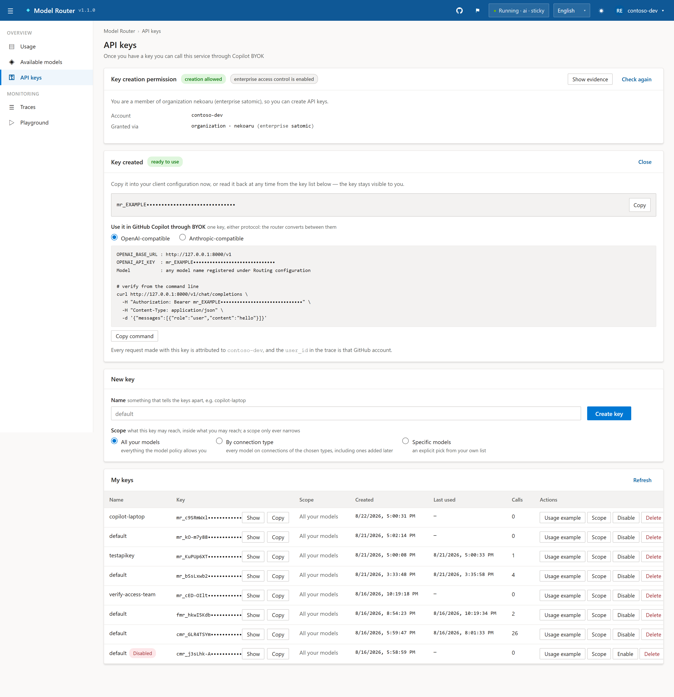

The key is shown in full, with a **Copy** button and a ready-made configuration block for GitHub
Copilot BYOK. The block comes in both protocols: pick **OpenAI-compatible** or **Anthropic-compatible**
and the environment variables and the `curl` line change together, so you can paste the one your
client actually wants. **Copy command** copies the whole snippet. Every call made with this key is
attributed to your login, so treat it as your own credential: anything sent with it appears under your
name in the traces and in the usage statistics.

The **My keys** table lists each key with its scope, creation time, last use and call count, and lets
you reveal, copy, disable or delete it. **Scope** opens the same editor inline, so a key handed to a CI
job can be narrowed once its needs are known rather than at the moment it was created; the change takes
effect on the very next request. Without the permission the button appears only on keys that already
carry a restriction, and then only to clear it back to all models and all connection types. A
disabled key is refused with a 401 without being deleted, which is the right first move if you think
a key has leaked.

**Usage example** on any row reopens that configuration block later. The panel above appears once,
straight after creation, so a key made last month had nowhere left to tell you the base URL, the
header names or the `curl` line. The row has it, in both protocols, with your key filled in and the
same **Copy command** button. Opening it also unmasks that key in the table, so the row and the
snippet cannot disagree about what is on screen, and closing it masks the key again. Two cases show
`YOUR_API_KEY` in place of the value and say which case it is: a key created before the router kept
readable key values, where you paste in the value you saved or create a new key, and, for an
administrator viewing **All users**, somebody else's key, whose value is only ever shown to its owner.

### 3.5 Send requests

Point any OpenAI-compatible **or** Anthropic-compatible client at the router. Three fields either
way:

| Field | OpenAI-compatible client | Anthropic-compatible client |
|---|---|---|
| Base URL | `http://<host>:8000/v1` | `http://<host>:8000` |
| API Key | your `mr_…` key, as `Authorization: Bearer` | your `mr_…` key, as `x-api-key` |
| Model | any model name from your Available models page | the same, or `auto` |

One key works on both. Which protocol you speak has no bearing on which models you can reach: the
router converts, so an Anthropic-style client can be answered by an Azure deployment and the reverse.
The `model` field is a request, not an instruction, because the routing strategy decides the model and
the trace records which one it chose.

**GitHub Copilot (BYOK)**: add an OpenAI-compatible provider with the three values above. Copilot
sends no user identity of its own, which is exactly why attribution comes from the key's owner; it
does send `x-interaction-id`, so its tool-call loop is routed once and recorded as one trace.

**curl**:

```bash
# OpenAI-compatible
curl http://127.0.0.1:8000/v1/chat/completions \
  -H "Authorization: Bearer mr_..." \
  -H "Content-Type: application/json" \
  -d '{"model":"gpt-4o","messages":[{"role":"user","content":"Refactor this module and explain the design"}]}'

# Anthropic-compatible
curl http://127.0.0.1:8000/v1/messages \
  -H "x-api-key: mr_..." \
  -H "anthropic-version: 2023-06-01" \
  -H "Content-Type: application/json" \
  -d '{"model":"auto","max_tokens":256,"messages":[{"role":"user","content":"Refactor this module and explain the design"}]}'
```

For an Anthropic-style client set `ANTHROPIC_BASE_URL` to `http://<host>:8000` and
`ANTHROPIC_AUTH_TOKEN` to your `mr_…` key.

The response headers say what happened without opening the console at all: `x-routed-model`,
`x-router-reason`, `x-router-decision-ms`, `x-trace-id`, and `x-router-interaction-id` when the
request carried one.

**The Playground** is the same call without a client:


Paste your key, type a prompt, press **Send**, and the routing result (model, reason, decision
latency) appears above the response, with a link to the full trace.

### 3.6 Check what happened

**Traces** shows your own calls, with the same detail an administrator gets for theirs:


Useful when a model surprises you. The Routing decision pane names the rule that fired, or shows what
the decision model was asked and what it answered, so "why did my question go to the small model" has
a factual answer. Filter by date or by part of a trace id; a trace id is also returned in the
`x-trace-id` response header of every call.

### 3.7 Troubleshooting

| What you see | What it means | What to do |
|---|---|---|
| `401` from `/v1/chat/completions` | the key is missing, mistyped, disabled or deleted | check the Authorization header is `Bearer mr_…`; confirm the key is not `Disabled` on the API keys page |
| `403`, no models under the current policy | your model policy grant resolves to an empty set | ask an administrator to grant you a model group; Available models shows `empty-group` |
| `403` when creating a key | the key policy does not include any scope you belong to | quote the reason and **Granted via** text from the API keys panel to your administrator |
| Cannot sign in with GitHub at all | the sign-in scope is restricted to administrators, or the OAuth app is misconfigured | ask an administrator; they can still get in with the local administrator account |
| The model in the response is not the one you sent | that is the point: the router decided | open the trace: the Routing decision pane names the rule or the AI decision |
| Every call in a conversation reports the same model and `interaction-sticky` | session stickiness is on and your client sends `x-interaction-id` | expected; one decision is made per interaction |
| A model you expected is missing from Available models | the model policy in force does not grant it | the page states the reason and which grant applied |

---

Related documents: [Architecture and data flow](architecture.md) ·
[Router logic](router-logic.md) · [Configuration](configuration.md) ·
[Access control](access-control.md) · [Model policy](model-policy.md) ·
[Sign-in and authentication](authentication.md) · [Full-chain logging](traces.md) · [API](api.md)
